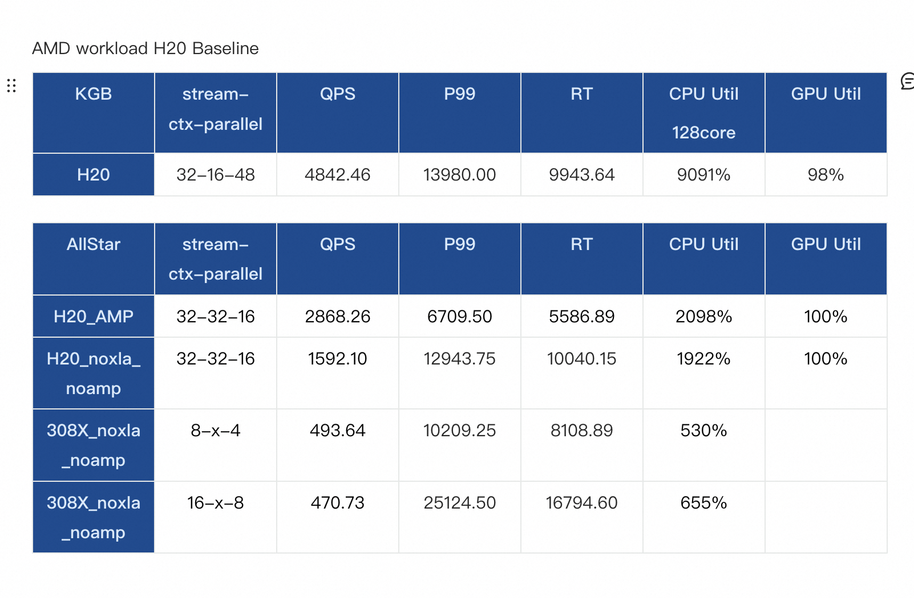

:wq
### ML Framework should know:
[Frameworks 101 - Every Question a Successful Member Should be Able to Answer - Machine Learning Software Engineering - Confluence (amd.com)](https://confluence.amd.com/display/MLSE/Frameworks+101+-+Every+Question+a+Successful+Member+Should+be+Able+to+Answer)

[Frameworks 101 - Every Question a Successful Member Should be Able to Answer - Machine Learning Software Engineering - Confluence (amd.com)](https://confluence.amd.com/display/MLSE/Frameworks+101+-+Every+Question+a+Successful+Member+Should+be+Able+to+Answer)

### Run Ads model benchmark with AIibaba origin source code
1.get one useful nvidia ncp tensorflow-1.15 docker image：
``` shell
docker pull nvcr.io/nvidia/tensorflow:23.03-tf1-py
```

2.change local cuda version to 12.1
``` shell
update-alternatives --display cuda

update-alternatives --config cuda
```
#### compile issue:
1.nvidia ngc tensoflow-1.15 docker image do not have the special version of libcupti.so, just modify the soname of old libcupti.so version (if use cuda-12.1).
``` shell
cp /usr/local/cuda-12.1/targets/x86_64-linux/lib/

cp libcupti.so.2023.1.0 libcupti.so.12.1

apt-get update
apt-get install patchelf
patchelf --set-soname libcupti.so.12.1 libcupti.so.12.1
readelf -d libcupti.so.12.1
>  0x0000000000000001 (NEEDED)             Shared library: [libpthread.so.0]
>  0x0000000000000001 (NEEDED)             Shared library: [librt.so.1]
>  0x0000000000000001 (NEEDED)             Shared library: [libdl.so.2]
>  0x0000000000000001 (NEEDED)             Shared library: [libutil.so.1]
>  0x0000000000000001 (NEEDED)             Shared library: [libm.so.6]
>  0x0000000000000001 (NEEDED)             Shared library: [libgcc_s.so.1]
>  0x0000000000000001 (NEEDED)             Shared library: [libc.so.6]
>  0x0000000000000001 (NEEDED)             Shared library: [ld-linux-x86-64.so.2]
>  0x000000000000000e (SONAME)             Library soname: [libcupti.so.12.1]
```

2.fix grpc `long gettid(void) __THROW` issue:
``` shell
# cd bazel local cache grpc dir(need run once)
cd /.cache/bazel/_bazel_root/65d631e677714fb85e6cb242d4822709/external/grpc

wget https://nomeroff.net.ua/tf/Rename-gettid-functions.patch

patch -p1 Rename-gettid-functions.patch 
or
git apply Rename-gettid-functions.patch
```

3.fix `nvcc not support compute_35` issue:
``` shell
vim third_party/gpus/crosstool/clang/bin/crosstool_wrapper_driver_is_not_gcc.tpl

Line218 add: 
215 nvccopts += std_options
216  nvccopts += m_options
217  nvccopts += warning_options
+ 218 nvccopts += r'-gencode=arch=compute_35,\"code=sm_35,compute_35\"'
```


### Run Ads model benchmark with AIibaba origin source code
get one useful nvidia ncp tensorflow-1.15 docker image (cuda-11.2)：
``` shell
nvcr.io/nvidia/tensorflow:21.02-tf1-py3
or
nvcr.io/nvidia/cuda:11.2.2-cudnn8-devel-ubuntu18.0
```

fix grpc `long gettid(void) __THROW` issue (cause by gcc-9):
``` shell
# cd bazel local cache grpc dir(need run once)
cd /.cache/bazel/_bazel_root/65d631e677714fb85e6cb242d4822709/external/grpc

wget https://nomeroff.net.ua/tf/Rename-gettid-functions.patch

patch -p1 Rename-gettid-functions.patch 
or
git apply Rename-gettid-functions.patch
```

fix `cannot convert ‘std::nullptr_t’ to ‘Py_ssize_t’ {aka ‘long int’} in initialization` issue:
``` shell
wget https://patch-diff.githubusercontent.com/raw/tensorflow/tensorflow/pull/33575.patch

git apply 33575.patch
```

H20 base:


### Alibaba Ads performance
``` shell
1. change system config to CPX (+NPS?) : segregate system resources to allow higher utilization

2. tune GEMM kernels for CPX : 
	a. GEMM size ==> let GEMM kernels efficiently use reduced CU #

3. integrate hipblaslt + improve GEMM integration logic + improve GEMM tuning process?

4. continue investigate deficiencies in XLA fusion/code emission

5. study the feasibility to cache previously prepared AQL packets for repeated kernel launches to reduce HIP runtime overhead
```