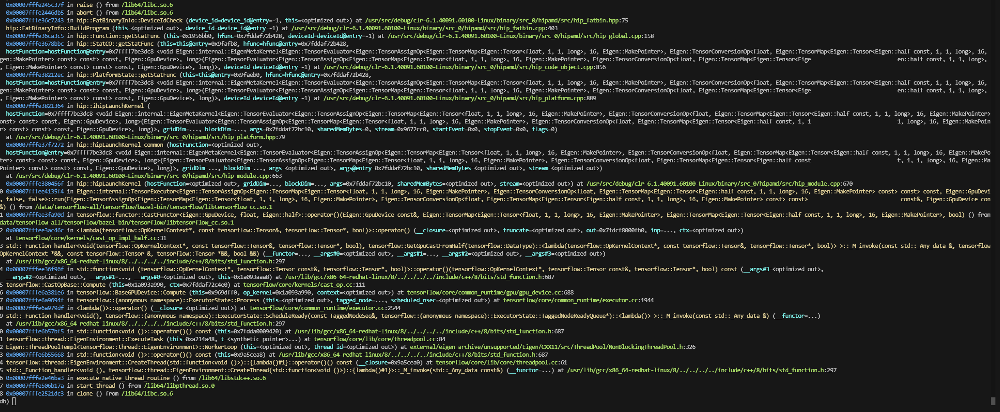

### Double link issue of tensorflow compali
core stack:


hip-runtime coredump, we see static StreamSet  \_M_element_count = 0，which means no stream instance in the StreamSet
``` c++
  _M_h = {<std::__detail::_Hashtable_base<hip::Stream*, hip::Stream*, std::__detail::_Identity, std::equal_to<hip::Stream*>, std::hash<hip::Stream*>, std::__detail::_Mod_range_hashing, std::__detail::_Default_ranged_hash, std::__detail::_Hashtable_traits<false, true, true> >> = {<std::__detail::_Hash_code_base<hip::Stream*, hip::Stream*, std::__detail::_Identity, std::hash<hip::Stream*>, std::__detail::_Mod_range_hashing, std::__detail::_Default_ranged_hash, false>> = {<std::__detail::_Hashtable_ebo_helper<0, std::__detail::_Identity, true>> = {<std::__detail:                           ::_Identity> = {<No data fields>}, <No data fields>}, <std::__detail::_Hashtable_ebo_helper<1, std::hash<hip::Stream*>, true>> = {<std::hash<hip::Stream*>> = {<std::__hash_base<unsigned long, hip::Stream*>> = {<No data fields>}, <No data fields>}, <No data fields>}, <std::__detail::_                           _Hashtable_ebo_helper<2, std::__detail::_Mod_range_hashing, true>> = {<std::__detail::_Mod_range_hashing> = {<No data fields>}, <No data fields>}, <No data fields>}, <std::__detail::_Hashtable_ebo_helper<0, std::equal_to<hip::Stream*>, true>> = {<std::equal_to<hip::Stream*>> = {<std:                           ::binary_function<hip::Stream*, hip::Stream*, bool>> = {<No data fields>}, <No data fields>}, <No data fields>}, <No data fields>}, <std::__detail::_Map_base<hip::Stream*, hip::Stream*, std::allocator<hip::Stream*>, std::__detail::_Identity, std::equal_to<hip::Stream*>, std::hash<hip                           p::Stream*>, std::__detail::_Mod_range_hashing, std::__detail::_Default_ranged_hash, std::__detail::_Prime_rehash_policy, std::__detail::_Hashtable_traits<false, true, true>, true>> = {<No data fields>}, <std::__detail::_Insert<hip::Stream*, hip::Stream*, std::allocator<hip::Stream*>                           >, std::__detail::_Identity, std::equal_to<hip::Stream*>, std::hash<hip::Stream*>, std::__detail::_Mod_range_hashing, std::__detail::_Default_ranged_hash, std::__detail::_Prime_rehash_policy, std::__detail::_Hashtable_traits<false, true, true>, true>> = {<std::__detail::_Insert_base<                           <hip::Stream*, hip::Stream*, std::allocator<hip::Stream*>, std::__detail::_Identity, std::equal_to<hip::Stream*>, std::hash<hip::Stream*>, std::__detail::_Mod_range_hashing, std::__detail::_Default_ranged_hash, std::__detail::_Prime_rehash_policy, std::__detail::_Hashtable_traits<fal                           lse, true, true> >> = {<No data fields>}, <No data fields>}, <std::__detail::_Rehash_base<hip::Stream*, hip::Stream*, std::allocator<hip::Stream*>, std::__detail::_Identity, std::equal_to<hip::Stream*>, std::hash<hip::Stream*>, std::__detail::_Mod_range_hashing, std::__detail::_Defau                           ult_ranged_hash, std::__detail::_Prime_rehash_policy, std::__detail::_Hashtable_traits<false, true, true>, std::integral_constant<bool, true> >> = {<No data fields>}, <std::__detail::_Equality<hip::Stream*, hip::Stream*, std::allocator<hip::Stream*>, std::__detail::_Identity, std::eq                           qual_to<hip::Stream*>, std::hash<hip::Stream*>, std::__detail::_Mod_range_hashing, std::__detail::_Default_ranged_hash, std::__detail::_Prime_rehash_policy, std::__detail::_Hashtable_traits<false, true, true>, true>> = {<No data fields>}, <std::__detail::_Hashtable_alloc<std::allocat                           tor<std::__detail::_Hash_node<hip::Stream*, false> > >> = {<std::__detail::_Hashtable_ebo_helper<0, std::allocator<std::__detail::_Hash_node<hip::Stream*, false> >, true>> = {<std::allocator<std::__detail::_Hash_node<hip::Stream*, false> >> = {<__gnu_cxx::new_allocator<std::__detail:                           ::_Hash_node<hip::Stream*, false> >> = {<No data fields>}, <No data fields>}, <No data fields>}, <No data fields>}, _M_buckets = 0x7fffe5058130 <hip::streamSet+48>, _M_bucket_count = 1, _M_before_begin = {_M_nxt = 0x0}, _M_element_count = 0, _M_rehash_policy = {
      static _S_growth_factor = 2, _M_max_load_factor = 1, _M_next_resize = 0}, _M_single_bucket = 0x0}}
```

the main reason for this, cause by double link issue in the compliation of tensorlfow，导致创建stream的时候是一个加载的libamdhip64.so内存空间，且设置了该空间中的streamSet
``` c++
static amd::Monitor streamSetLock{"Guards global stream set"};
static std::unordered_set<hip::Stream*> streamSet;

Stream::Stream(hip::Device* dev, Priority p, unsigned int f, bool null_stream,
               const std::vector<uint32_t>& cuMask, hipStreamCaptureStatus captureStatus)
    : amd::HostQueue(*dev->asContext(), *dev->devices()[0], 0, amd::CommandQueue::RealTimeDisabled,
        convertToQueuePriority(p), cuMask),
      lock_("Stream Callback lock"),
      device_(dev),
      priority_(p),
      flags_(f),
      null_(null_stream),
      cuMask_(cuMask),
      captureStatus_(captureStatus),
      originStream_(false),
      captureID_(0)
      {
        amd::ScopedLock lock(streamSetLock);
        streamSet.insert(this);
      }
```
 但是运行的时候是另外一个的空间，该地址空间中streamSet是空的，导致安全检查的时候，abort core
```c++
int Stream::DeviceId(const hipStream_t hStream) {
  // Copying locally into non-const variable just to get const away
  hipStream_t inputStream = hStream;
  if (!hip::isValid(inputStream)) {
    //return invalid device id
    return -1;
  }
  hip::Stream* s = reinterpret_cast<hip::Stream*>(inputStream);
  int deviceId = (s != nullptr)? s->DeviceId() : ihipGetDevice();
  assert(deviceId >= 0 && deviceId < static_cast<int>(g_devices.size()));
  return deviceId;
}

bool isValid(hipStream_t& stream) {
  // NULL stream is always valid
  if (stream == nullptr) {
    return true;
  }

  if (hipStreamPerThread == stream) {
    getStreamPerThread(stream);
  }

  hip::Stream* s = reinterpret_cast<hip::Stream*>(stream);
  amd::ScopedLock lock(streamSetLock);
  if (streamSet.find(s) == streamSet.end()) {
    return false;
  }
  return true;
}
```

解决办法：
1.Just enable this path [https://github.com/ROCm/tensorflow-upstream/blob/r1.15-rocm61-albm/tensorflow/stream_executor/rocm/rocm_driver_wrapper.h#L32](https://github.com/ROCm/tensorflow-upstream/blob/r1.15-rocm61-albm/tensorflow/stream_executor/rocm/rocm_driver_wrapper.h#L32 "https://github.com/rocm/tensorflow-upstream/blob/r1.15-rocm61-albm/tensorflow/stream_executor/rocm/rocm_driver_wrapper.h#l32") For example replace "#ifdef PLATFORM_GOOGLE" with "#if 1".
2.手动改一下tensorflow下编译时候local copy的libamdhip64.so，删除该文件，并简历链接指向/opt/rocm/libamdhip64.so

新的coredump：


cchen@10.67.154.101  passwd：123123
pavel@10.67.154.101  passwd：123123
dragan@10.67.154.101  passwd：123123
cd  /mnt/ && mkdir {your_owen_dir} && cp -r /mnt/yuechguo/tensorflow-all {your_owen_dir}/