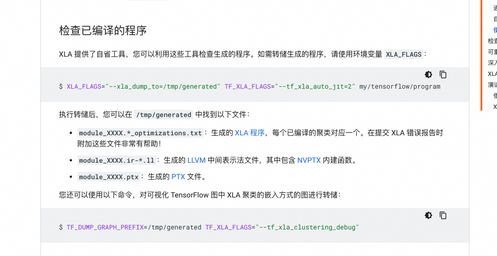

log with time
```

here :
``` shell
your_command > "$(date +%Y-%m-%d_%H-%M-%S)_output.txt"
```

rocm-6.3.0.1#16  amd repo addr:
``` shell
[rocm]  
name=rocm  
baseurl=https://compute-artifactory.amd.com/artifactory/list/rocm-osdb-rhel-8.x/compute-rocm-rel-6.3.0.1-16/ 
enabled=1  
gpgcheck=0
```

HJBOG-10：amdtest/617088

hip-runtime build:
``` shell
cmake -DHIP_COMMON_DIR=/data/testhome/mainline-rocm-runtime/HIP -DHIP_PLATFORM=amd -DCMAKE_PREFIX_PATH="/opt/rocm/" -DCMAKE_BUILD_TYPE="RelWithDebInfo" -DCMAKE_INSTALL_LIBDIR=lib -DCMAKE_INSTALL_PREFIX=$PWD/install -DHIP_CATCH_TEST=0 -DCLR_BUILD_HIP=ON -DCLR_BUILD_OCL=OFF ../

cmake -DHIP_COMMON_DIR=/data/testhome/mainline-rocm-runtime/HIP -DHIP_PLATFORM=amd -DCMAKE_PREFIX_PATH="/opt/rocm/" -DCMAKE_BUILD_TYPE="RelWithDebInfo" -DCMAKE_INSTALL_LIBDIR=lib -DCMAKE_INSTALL_PREFIX=/opt/rocm -DHIP_CATCH_TEST=0 -DCLR_BUILD_HIP=ON -DCLR_BUILD_OCL=OFF ../

Setup Development Env:
cp amd_new_base/HIP/include/hip/* /opt/rocm/include/hip/

Debug Mode:
-DCMAKE_BUILD_TYPE="RelWithDebInfo"  -> -DCMAKE_BUILD_TYPE="Debug"

with asan:
cmake -DHIP_COMMON_DIR=/data/testhome/mainline-rocm-runtime/hip -DHIP_PLATFORM=amd -DCMAKE_PREFIX_PATH="/opt/rocm/" -DCMAKE_BUILD_TYPE="RelWithDebInfo" -DCMAKE_INSTALL_LIBDIR=lib -DCMAKE_INSTALL_PREFIX=$PWD/install -DHIP_CATCH_TEST=0 -DCLR_BUILD_HIP=ON -DCLR_BUILD_OCL=OFF -DADDRESS_SANITIZER=ON -DENABLE_ASAN_PACKAGING=1 ../

```


ROCR-runtime build:
``` shell
cmake -DCMAKE_INSTALL_LIBDIR=lib -DCMAKE_INSTALL_PREFIX=/opt/rocm -DCMAKE_BUILD_TYPE="RelWithDebInfo" -DBUILD_SHARED_LIBS=1 ../  
make -j 30  
make package

with asan:
cmake -DCMAKE_INSTALL_LIBDIR=lib -DCMAKE_INSTALL_PREFIX=/opt/rocm -DCMAKE_BUILD_TYPE="RelWithDebInfo" -DBUILD_SHARED_LIBS=1  -DADDRESS_SANITIZER=ON -DENABLE_ASAN_PACKAGING=1 ../
```

``` shell
To build ROCr/HIP for ASAN:

export LLVM_BIN_DIR=/opt/rocm-6.3.0.1/llvm/bin  
export CC="$LLVM_BIN_DIR/clang"  
export CXX="$LLVM_BIN_DIR/clang++"  
export CXX_FLAGS=-fsanitize=address -shared-libasan -g -gdwarf-4

cd <ROCR-DIR>  
mkdir build;cd build  
cmake -DCMAKE_INSTALL_PATH=/opt/rocm -DCMAKE_BUILD_TYPE="Debug" -D-DHIP_COMMON_DIR=/data/testhome/mainline-rocm-runtime/amd_new_base/HIP/

cd <CLR-DIR>  
mkdir build;cd build  
cmake -DHIP_COMMON_DIR=/data/testhome/mainline-rocm-runtime/amd_new_base/HIP/ -DHIP_PLATFORM=amd -DCMAKE_PREFIX_PATH="/opt/rocm/  
" -DCMAKE_BUILD_TYPE="Debug" -DCMAKE_INSTALL_LIBDIR=lib-DCMAKE_INSTALL_PREFIX=/opt/rocm -DHIP_CATCH_TEST=0 -DCLR_BUILD_HIP=ON -DCLR_BUILD_OCL=OFF -DADDR  
ESS_SANITIZER=ON -DENABLE_ASAN_PACKAGING=1
```

ROCR-debug-agent build：
``` shell
cmake -DCMAKE_BUILD_TYPE=Release -DROCM_PATH=/opt/rocm -DCMAKE_INSTALL_PREFIX=$PWD/install ..
```

env：
``` shell
HJBOG10  10.67.158.121 amdtest/617088  

numactl --cpunodebind=0 --membind=0
```

``` shell
/opt/rocm/bin/rocsys --session MYS launch /opt/rocm/bin/rocprofv2 --hip-api --hip-activity --kernel-trace --plugin perfetto -d /home/hongtaom/perf_dump/

/opt/rocm/bin/rocsys --session MYS start

/opt/rocm/bin/rocsys --session MYS stop
```

```
sudo perf record -p {top查看pid} -g --call-graph lbr -- sleep 10  
sudo perf script -i perf.data &> perf.unfold  
# cd FlameGraph (from git clone [https://github.com/brendangregg/FlameGraph.git)](https://github.com/brendangregg/FlameGraph.git))  
./stackcollapse-perf.pl perf.unfold &> perf.folded  
./flamegraph.pl perf.folded > perf.svg
```

OSS连线机器
``` shell
OSS的連線機器
Windows RDP (Shanghai vpn only, ex: shanghai1-4 cannot not access this system)
10.69.66.49 amdtest / amdtest321!
```




``` shell
export AMD_LOG_LEVEL=4  
export AMD_LOG_MASK=2  
export GPU_FORCE_QUEUE_PROFILING=1  
export AMD_LOG_LEVEL_FILE=hip_log.txt

export HSA_TOOLS_LIB=/opt/rocm/lib/librocm-debug-agent.so.2  
export ROCM_DEBUG_AGENT_OPTIONS=-p  
export HSA_ENABLE_DEBUG=1
```

``` shell
cp gc_9_4_4_mec.bin /usr/lib/firmware/updates/amdgpu/gc_9_4_4_mec.bin

黑名单驱动 
 grubby --args="modprobe.blacklist=amdgpu" --update-kernel /boot/vmlinuz-5.10.134-13.al8.x86_64

sudo grub2-mkconfig -o /boot/grub2/grub.cfg

解除黑名单驱动 
grubby --update-kernel=/boot/vmlinuz-`uname -r` --remove-args="modprobe.blacklist=amdgpu"
```

``` shell
#!/bin/bash  
  
roc-obj-ls ./bazel-out/k8-opt/bin/tensorflow/python/_pywrap_tensorflow_internal.so | grep gfx942 > code_objects.txt  
cat code_objects.txt | awk '{print $3}' > code_objects_descriptors.txt  
cat code_objects_descriptors.txt | xargs roc-obj-extract  
find . -name "*.co" | xargs /opt/rocm/llvm/bin/llvm-objdump --disassemble > isa.txt
```

``` shell
disable C1E :
https://github.com/intel/CommsPowerManagement/blob/main/power.md

cpupower idle-info  
Number of idle states: 4  
Available idle states: POLL C1 C1E C6  
POLL:  
Flags/Description: CPUIDLE CORE POLL IDLE  
Latency: 0  
Usage: 1290  
Duration: 3921  
C1:  
Flags/Description: MWAIT 0x00  
Latency: 1  
Usage: 589703  
Duration: 3217148978  
C1E:  
Flags/Description: MWAIT 0x01  
Latency: 2  
Usage: 113760  
Duration: 33824737  
C6 (DISABLED) :  
Flags/Description: MWAIT 0x20  
Latency: 190  
Usage: 0  
Duration: 0  
  
  
0x01=2  
cpupower idle-set -d 2  
C1E(Disable):  
Flags/Description: MWAIT 0x01  
Latency: 2  
Usage: 113760  
Duration: 33824737
```

```shell
秦文 id:belongwr email:wr418263@taobao.com
枭骑 id:WenchaoWangAlibaba email:wwc239608@taobao.com
费乾 id:JunchenDong-alibaba email:dongjunchen.djc@alibaba-inc.com
```

``` shell
ROCM_DEBUG_AGENT_OPTIONS="--all --save-code-objects -l info -p"

/opt/rocm/llvm/bin/llvm-objdump --source --mcpu=gfx942 $FILE > dissassembled.txt

生成llvm的编译code object：
/opt/rocm/llvm/bin/llc -mtriple=amdgcn-amd-amdhsa -mcpu=gfx942 -O3 -o test.s test.ll
```
