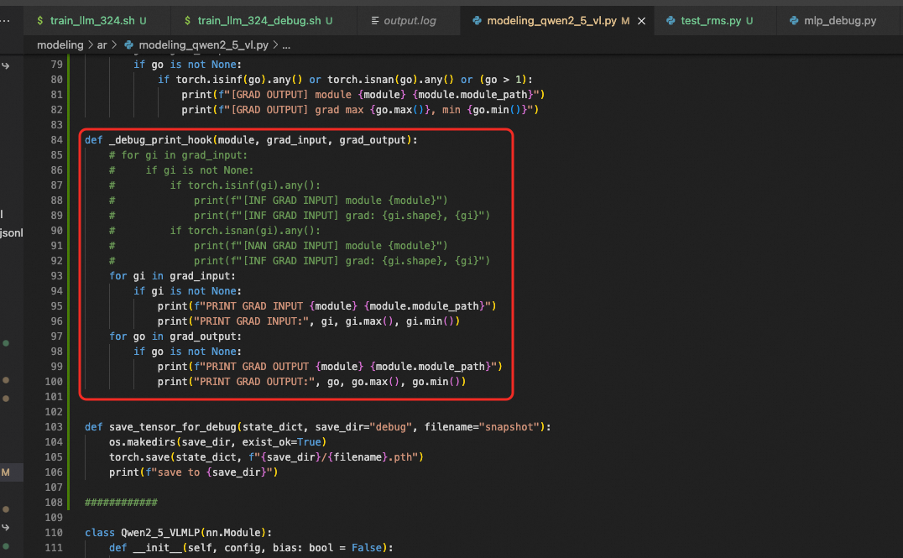

远程桌面，链接方式：
``` shell
10.69.66.79
amdtest/amdtest123@

```

### NAN训练问题复现：
#### 数据位置
```
hjbog-19 : /home/yuechguo/workplace/Ali-Wan2/

data input ：shark/
dataset ：high_quality_t2i_recollated_newpath_one.jsonl
```

#### 训练代码和训练框架swift
```
激活conda（训练都在conda环境中）：
conda init && conda activate
git clone https://github.com/modelscope/Nexus-Gen.git
cd Nexus-Gen && pip install -r requirements.txt

git clone https://github.com/modelscope/ms-swift.git
cd ms-swift/ && pip install -e .
```

#### 业务环境安装的package list
```
name: all2all
channels:
  - conda-forge
dependencies:
  - pip:
      - absl-py==2.2.2
      - accelerate==1.6.0
      - addict==2.4.0
      - aiofiles==24.1.0
      - aiohappyeyeballs==2.6.1
      - aiohttp==3.11.16
      - aiosignal==1.3.2
      - aliyun-python-sdk-core==2.16.0
      - aliyun-python-sdk-kms==2.16.5
      - annotated-types==0.7.0
      - anyio==4.9.0
      - asttokens==3.0.0
      - async-timeout==5.0.1
      - attrdict==2.0.1
      - attrs==25.3.0
      - av==14.3.0
      - binpacking==1.5.2
      - click==8.1.8
      - comm==0.2.2
      - contourpy==1.3.2
      - controlnet-aux==0.0.7
      - cpm-kernels==1.0.11
      - cramjam==2.9.1
      - crcmod==1.7
      - cryptography==44.0.2
      - cupy-cuda12x==13.4.1
      - cycler==0.12.1
      - dacite==1.9.2
      - dashscope==1.23.0
      - datahub==1.0.20
      - datasets==3.2.0
      - debugpy==1.8.13
      - decorator==5.2.1
      - deepspeed==0.16.4
      - dill==0.3.8
      - docker-pycreds==0.4.0
      - einops==0.8.1
      - exceptiongroup==1.2.2
      - executing==2.2.0
      - fastapi==0.115.12
      - fastparquet==2024.11.0
      - fastrlock==0.8.3
      - ffmpy==0.5.0
      - filelock==3.16.1
      - flash-attn==2.7.4.post1
      - fonttools==4.57.0
      - frozenlist==1.5.0
      - fsspec==2024.9.0
      - ftfy==6.3.1
      - future==1.0.0
      - gitdb==4.0.12
      - gitpython==3.1.44
      - gradio==5.25.2
      - gradio-client==1.8.0
      - groovy==0.1.2
      - grpcio==1.71.0
      - h11==0.14.0
      - hjson==3.1.0
      - httpcore==1.0.8
      - httpx==0.28.1
      - huggingface-hub==0.30.1
      - imageio==2.37.0
      - imageio-ffmpeg==0.6.0
      - importlib-metadata==8.6.1
      - ipykernel==6.29.5
      - ipython==8.34.0
      - jedi==0.19.2
      - jieba==0.42.1
      - jinja2==3.1.5
      - jiter==0.9.0
      - jmespath==0.10.0
      - joblib==1.4.2
      - jupyter-client==8.6.3
      - jupyter-core==5.7.2
      - kiwisolver==1.4.8
      - lazy-loader==0.4
      - markdown==3.8
      - markdown-it-py==3.0.0
      - markupsafe==3.0.2
      - matplotlib==3.10.1
      - matplotlib-inline==0.1.7
      - mdurl==0.1.2
      - modelscope==1.24.1
      - mpmath==1.3.0
      - msgpack==1.1.0
      - multidict==6.3.2
      - multiprocess==0.70.16
      - nest-asyncio==1.6.0
      - networkx==3.4.2
      - ninja==1.11.1.4
      - nltk==3.9.1
      - numpy==1.26.4
      - openai==1.75.0
      - opencv-python-headless==4.11.0.86
      - orjson==3.10.16
      - oss2==2.19.1
      - pandas==2.2.3
      - pangudfs-client==1.0.1+lightsdk1.1.22
      - parso==0.8.4
      - peft==0.14.0
      - pexpect==4.9.0
      - pillow==11.0.0
      - prompt-toolkit==3.0.50
      - propcache==0.3.1
      - protobuf==5.29.4
      - psutil==7.0.0
      - ptyprocess==0.7.0
      - pure-eval==0.2.3
      - py-cpuinfo==9.0.0
      - pyarrow==19.0.1
      - pycryptodome==3.22.0
      - pydantic==2.11.1
      - pydantic-core==2.33.0
      - pydub==0.25.1
      - pygments==2.19.1
      - pyparsing==3.2.3
      - python-dateutil==2.9.0.post0
      - python-multipart==0.0.20
      - pytz==2025.2
      - pyyaml==6.0.2
      - pyzmq==26.3.0
      - qwen-vl-utils==0.0.10
      - regex==2024.11.6
      - rich==14.0.0
      - rouge==1.0.1
      - ruff==0.11.6
      - safehttpx==0.1.6
      - safetensors==0.5.3
      - scikit-image==0.25.2
      - scipy==1.15.2
      - semantic-version==2.10.0
      - sentencepiece==0.2.0
      - sentry-sdk==2.26.1
      - setproctitle==1.3.5
      - setuptools==69.5.1
      - shellingham==1.5.4
      - simplejson==3.20.1
      - six==1.17.0
      - smmap==5.0.2
      - sniffio==1.3.1
      - sortedcontainers==2.4.0
      - stack-data==0.6.3
      - starlette==0.46.2
      - sympy==1.13.1
      - tensorboard==2.19.0
      - tensorboard-data-server==0.7.2
      - tifffile==2025.3.30
      - tiktoken==0.9.0
      - timm==1.0.15
      - tokenizers==0.21.1
      - tomlkit==0.13.2
      - tornado==6.4.2
      - traitlets==5.14.3
      - transformers==4.49.0
      - transformers-stream-generator==0.0.5
      - trl==0.16.1
      - typer==0.15.2
      - typing-extensions==4.12.2
      - typing-inspection==0.4.0
      - tzdata==2025.2
      - uvicorn==0.34.1
      - wandb==0.19.9
      - wcwidth==0.2.13
      - websocket-client==1.8.0
      - websockets==15.0.1
      - werkzeug==3.1.3
      - xxhash==3.5.0
      - yarl==1.19.0
      - zipp==3.21.0
prefix: /home/admin/miniconda3/envs/all2all
```

#### 训练启动
``` 
可以先修改train/scripts/train_llm.sh中，用单卡训练
cd Nexus-Gen && bash train/scripts/train_llm.sh
```

#### 代码中hook的位置（打印tensor值的位置）
