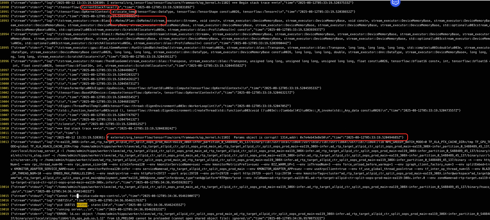
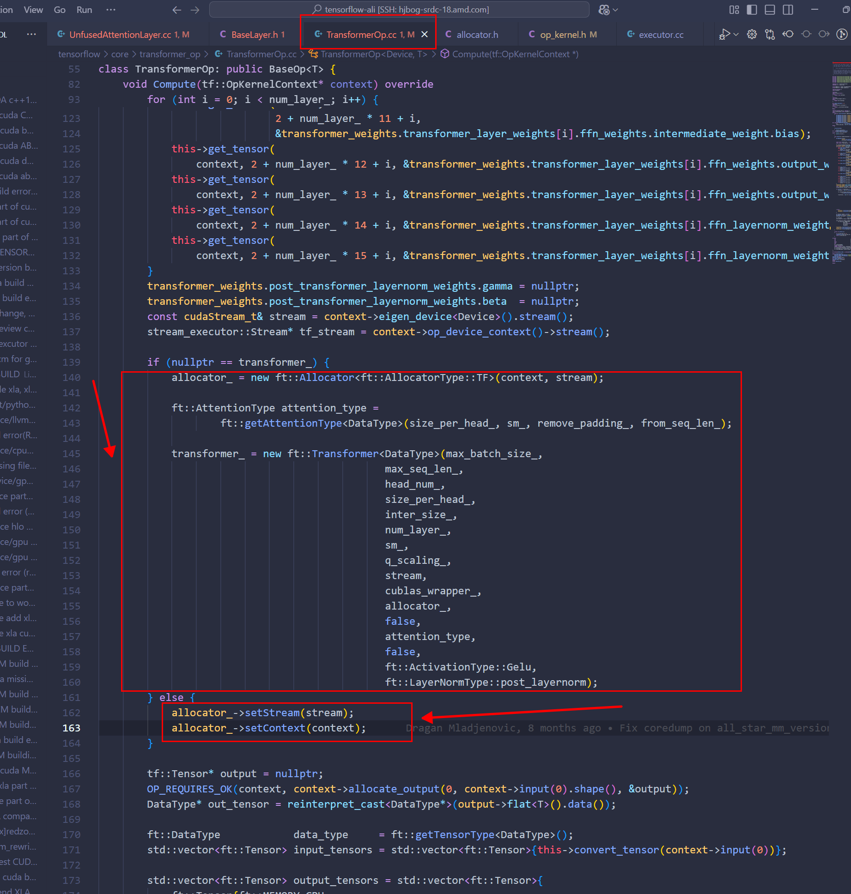

TF build with address sanitize
```
build:rocm_asan --linkopt=-shared-libsan --linkopt=-fsanitize=address  
build:rocm_asan  --copt=-fsanitize=address
```

running options
```
ASAN_OPTIONS="detect_leaks=0,detect_odr_violation=0"
```

### After feiqian‘s fix about Allocator 
still have some crash
``` c++
warning: Unexpected size of section `.reg-xstate/9358' in core file.  
#0  0x00007feaa5008d6b in tensorflow::OpKernelContext::allocate_temp () at external/org_tensorflow/tensorflow/core/framework/op_kernel.h:1082  
1082  external/org_tensorflow/tensorflow/core/framework/op_kernel.h: No such file or directory.  
[Current thread is 1 (Thread 0x7ea2f6dfa640 (LWP 9358))]  
(gdb)  
(gdb)  
(gdb) bt  
#0  0x00007feaa5008d6b in tensorflow::OpKernelContext::allocate_temp () at external/org_tensorflow/tensorflow/core/framework/op_kernel.h:1082  
#1  fastertransformer::BlasScratchAllocator::AllocateBytes () at external/org_tensorflow/tensorflow/core/transformer_op/layers/BaseLayer.h:105  
#2  0x00007feaa8788a8d in stream_executor::rocm::BlasLt::MatmulPlan::DoMatmul () at external/org_tensorflow/tensorflow/stream_executor/rocm/hip_blas_lt.cc:388  
#3  0x00007feaa8787c68 in stream_executor::gpu::BlasLt::MatmulPlan::DoMatmul<std::complex<float> > ()  
   at external/org_tensorflow/tensorflow/stream_executor/gpu/gpu_blas_lt.h:202  
#4  stream_executor::rocm::BlasLt::MatmulPlan::ExecuteOnStream () at external/org_tensorflow/tensorflow/stream_executor/rocm/hip_blas_lt.cc:484  
#5  0x00007fea9d9c88c1 in operator() () at external/org_tensorflow/tensorflow/stream_executor/gpu/gpu_blas_lt_gemm_runner.cc:340  
#6  Autotune<stream_executor::gpu::BlasLtGemmRunner::RunStridedBatchedImpl(stream_executor::Stream&, stream_executor::blas::Transpose, stream_executor::blas::Transpose, tensorflow::int64, tensorflow::int64, tensorflow::int64, xla::complex128, stream_executor::dnn::DataType, const stream_executor::DeviceMemoryBase&, tensorflow::int64, tensorflow::int64, stream_executor::dnn::DataType, const stream_executor::DeviceMemoryBase&, tensorflow::int64, tensorflow::int64, double, stream_executor::dnn::DataType, stream_executor::DeviceMemoryBase*, tensorflow::int64, tensorflow::int64, tensorflow::int64, stream_executor::ScratchAllocator*)::<lambda(const stream_executor::gpu::BlasLt::MatmulAlgorithm&, stream_executor::blas::ProfileResult*)> > ()  
   at external/org_tensorflow/tensorflow/stream_executor/gpu/gpu_blas_lt_gemm_runner.cc:100  
#7  stream_executor::gpu::BlasLtGemmRunner::RunStridedBatchedImpl () at external/org_tensorflow/tensorflow/stream_executor/gpu/gpu_blas_lt_gemm_runner.cc:340  
#8  0x00007fea9d990b6c in stream_executor::gpu::BlasLtGemmRunner::Run<float, tensorflow::bfloat16, tensorflow::bfloat16, tensorflow::bfloat16> ()  
   at external/org_tensorflow/tensorflow/stream_executor/gpu/gpu_blas_lt_gemm_runner.h:140  
#9  stream_executor::Stream::ThenBlasGemm () at external/org_tensorflow/tensorflow/stream_executor/stream.cc:4564  
#10 0x00007feaa5008b61 in fastertransformer::FfnLayer<__hip_bfloat16>::forward () at external/org_tensorflow/tensorflow/core/transformer_op/layers/FfnLayer.cc:83  
#11 0x00007feaa50098b2 in fastertransformer::TensorParallelGeluFfnLayer<__hip_bfloat16>::forward ()  
   at external/org_tensorflow/tensorflow/core/transformer_op/layers/TensorParallelGeluFfnLayer.cc:37  
#12 0x00007feaa500081e in fastertransformer::Transformer<__hip_bfloat16>::forward ()  
   at external/org_tensorflow/tensorflow/core/transformer_op/model/Transformer.cc:365  
#13 0x00007feaa500137a in fastertransformer::Transformer<__hip_bfloat16>::forward ()  
   at external/org_tensorflow/tensorflow/core/transformer_op/model/Transformer.cc:246  
#14 0x00007feaa4ff732d in TransformerOp<Eigen::GpuDevice, tensorflow::bfloat16>::Compute ()  
   at external/org_tensorflow/tensorflow/core/transformer_op/TransformerOp.cc:181  
#15 0x00007fea9d60ef60 in tensorflow::BaseGPUDevice::Compute () at external/org_tensorflow/tensorflow/core/common_runtime/gpu/gpu_device.cc:687  
--Type <RET> for more, q to quit, c to continue without paging--  
#16 0x00007fea9d672d34 in Process () at external/org_tensorflow/tensorflow/core/common_runtime/executor.cc:1947  
#17 0x00007fea9d673f9f in operator() () at external/org_tensorflow/tensorflow/core/common_runtime/executor.cc:2547  
#18 __invoke_impl<void, tensorflow::(anonymous namespace)::ExecutorState::ScheduleReady(const TaggedNodeSeq&, tensorflow::(anonymous namespace)::ExecutorState::TaggedNodeReadyQueue*)::<lambda()>&> () at /usr/lib/gcc/x86_64-redhat-linux/10/../../../../include/c++/10/bits/invoke.h:60  
#19 __invoke_r<void, tensorflow::(anonymous namespace)::ExecutorState::ScheduleReady(const TaggedNodeSeq&, tensorflow::(anonymous namespace)::ExecutorState::TaggedNodeReadyQueue*)::<lambda()>&> () at /usr/lib/gcc/x86_64-redhat-linux/10/../../../../include/c++/10/bits/invoke.h:110  
#20 _M_invoke () at /usr/lib/gcc/x86_64-redhat-linux/10/../../../../include/c++/10/bits/std_function.h:291  
#21 0x00007fea9d748651 in std::function<void ()>::operator()() const () at /usr/lib/gcc/x86_64-redhat-linux/10/../../../../include/c++/10/bits/std_function.h:622  
#22 tensorflow::thread::EigenEnvironment::ExecuteTask () at external/org_tensorflow/tensorflow/core/lib/core/threadpool.cc:84  
#23 Eigen::ThreadPoolTempl<tensorflow::thread::EigenEnvironment>::WorkerLoop ()  
   at external/eigen_archive/unsupported/Eigen/CXX11/src/ThreadPool/NonBlockingThreadPool.h:326  
#24 0x00007fea9d745f28 in std::function<void ()>::operator()() const () at /usr/lib/gcc/x86_64-redhat-linux/10/../../../../include/c++/10/bits/std_function.h:622  
#25 tensorflow::thread::EigenEnvironment::CreateThread(std::function<void ()>)::{lambda()#1}::operator()() const ()  
   at external/org_tensorflow/tensorflow/core/lib/core/threadpool.cc:61  
#26 std::__invoke_impl<void, tensorflow::thread::EigenEnvironment::CreateThread(std::function<void ()>)::{lambda()#1}&>(std::__invoke_other, tensorflow::thread::EigenEnvironment::CreateThread(std::function<void ()>)::{lambda()#1}&) () at /usr/lib/gcc/x86_64-redhat-linux/10/../../../../include/c++/10/bits/invoke.h:60  
#27 std::__invoke_r<void, tensorflow::thread::EigenEnvironment::CreateThread(std::function<void ()>)::{lambda()#1}&>(tensorflow::thread::EigenEnvironment::CreateThread(std::function<void ()>)::{lambda()#1}&) () at /usr/lib/gcc/x86_64-redhat-linux/10/../../../../include/c++/10/bits/invoke.h:110  
#28 std::_Function_handler<void (), tensorflow::thread::EigenEnvironment::CreateThread(std::function<void ()>)::{lambda()#1}>::_M_invoke(std::_Any_data const&) ()  
   at /usr/lib/gcc/x86_64-redhat-linux/10/../../../../include/c++/10/bits/std_function.h:291  
#29 0x00007fea9c0e8b74 in execute_native_thread_routine () from /usr/lib64/libstdc++.so.6  
#30 0x00007feab13be3fb in start_thread () from /usr/lib64/libpthread.so.0  
#31 0x00007fea9c461e83 in clone () from /usr/lib64/libc.so.6
```

### improve



增加上面的打印信息后，实际测试发现，调用前opcontext类方法中的params 结构体被提前释放

### params析构时候的栈
Opcontext和Params 方法都是每个request都会被申请和释放，引起抓params析构时候的栈，通过单次run，来确定堆栈，堆栈如下
``` c++
#0  0x00007fffdd871bb5 in raise () from /lib64/libc.so.6  
#1  0x00007fffdd85a8a4 in abort () from /lib64/libc.so.6  
#2  0x00007fffe1fdbada in tensorflow::OpKernelContext::Params::~Params (this=<optimized out>, __in_chrg=<optimized out>)  
   at ./tensorflow/core/framework/op_kernel.h:641  
#3  0x00007fffe1fdbd39 in tensorflow::OpKernelContext::Params::~Params (this=<optimized out>, __in_chrg=<optimized out>)  
   at /usr/lib/gcc/x86_64-redhat-linux/10/../../../../include/c++/10/ext/atomicity.h:84  
#4  0x00007fffdee774e9 in tensorflow::(anonymous namespace)::ExecutorState::AsyncState::~AsyncState (this=0x7fdd84a8e400, __in_chrg=<optimized out>)  
   at tensorflow/core/common_runtime/executor.cc:1639  
#5  operator() (__closure=0x7fdeb69f4520) at tensorflow/core/common_runtime/executor.cc:1923  
#6  0x00007fffe6fac7e4 in std::function<void()>::operator() (this=0x7fdeb69f4520)  
   at /usr/lib/gcc/x86_64-redhat-linux/10/../../../../include/c++/10/bits/std_function.h:622  
#7  operator() (send_args=..., recv_args=..., is_dead=false, val=..., s=..., done=..., __closure=0x7fdd84aa43f0)  
   at tensorflow/core/kernels/sendrecv_ops.cc:163  
#8  std::__invoke_impl<void, tensorflow::(anonymous namespace)::make_recv_callback(tensorflow::OpKernelContext*, tensorflow::AsyncOpKernel::DoneCallback)::<lambda(tensorflow::AsyncOpKernel::DoneCallback, const tensorflow::Status&, const tensorflow::Rendezvous::Args&, const tensorflow::Rendezvous::Args&, const tensorflow::Tensor&, bool)>&, std::function<void()>&, const tensorflow::Status&, const tensorflow::Rendezvous::Args&, const tensorflow::Rendezvous::Args&, const tensorflow::Tensor&, bool> (__f=...) at /usr/lib/gcc/x86_64-redhat-linux/10/../../../../include/c++/10/bits/invoke.h:60  
#9  std::__invoke<tensorflow::(anonymous namespace)::make_recv_callback(tensorflow::OpKernelContext*, tensorflow::AsyncOpKernel::DoneCallback)::<lambda(tensorflow::AsyncOpKernel::DoneCallback, const tensorflow::Status&, const tensorflow::Rendezvous::Args&, const tensorflow::Rendezvous::Args&, const tensorflow::Tensor&, bool)>&, std::function<void()>&, const tensorflow::Status&, const tensorflow::Rendezvous::Args&, const tensorflow::Rendezvous::Args&, const tensorflow::Tensor&, bool> (__fn=...) at /usr/lib/gcc/x86_64-redhat-linux/10/../../../../include/c++/10/bits/invoke.h:95  
#10 std::_Bind<tensorflow::(anonymous namespace)::make_recv_callback(tensorflow::OpKernelContext*, tensorflow::AsyncOpKernel::DoneCallback)::<lambda(tensorflow::AsyncOpKernel::DoneCallback, const tensorflow::Status&, const tensorflow::Rendezvous::Args&, const tensorflow::Rendezvous::Args&, const tensorflow::Tensor&, bool)>(std::function<void()>, std::_Placeholder<1>, std::_Placeholder<2>, std::_Placeholder<3>, std::_Placeholder<4>, std::_Placeholder<5>)>::__call<void, tensorflow::Status const&, tensorflow::Rendezvous::Args const&, tensorflow::Rendezvous::Args const&, tensorflow::Tensor const&, bool&&, 0, 1, 2, 3, 4, 5> (__args=..., this=0x7fdd84aa43f0) at /usr/lib/gcc/x86_64-redhat-linux/10/../../../../include/c++/10/functional:416  
#11 std::_Bind<tensorflow::(anonymous namespace)::make_recv_callback(tensorflow::OpKernelContext*, tensorflow::AsyncOpKernel::DoneCallback)::<lambda(tensorflow::AsyncOpKernel::DoneCallback, const tensorflow::Status&, const tensorflow::Rendezvous::Args&, const tensorflow::Rendezvous::Args&, const tensorflow::Tensor&, bool)>(std::function<void()>, std::_Placeholder<1>, std::_Placeholder<2>, std::_Placeholder<3>, std::_Placeholder<4>, std::_Placeholder<5>)>::operator()<const tensorflow::Status&, const tensorflow::Rendezvous::Args&, const tensorflow::Rendezvous::Args&, const tensorflow::Tensor&, bool> (  
   this=0x7fdd84aa43f0) at /usr/lib/gcc/x86_64-redhat-linux/10/../../../../include/c++/10/functional:499  
#12 std::__invoke_impl<void, std::_Bind<tensorflow::(anonymous namespace)::make_recv_callback(tensorflow::OpKernelContext*, tensorflow::AsyncOpKernel::DoneCallback)::<lambda(tensorflow::AsyncOpKernel::DoneCallback, const tensorflow::Status&, const tensorflow::Rendezvous::Args&, const tensorflow::Rendezvous::Args&, const tensorflow::Tensor&, bool)>(std::function<void()>, std::_Placeholder<1>, std::_Placeholder<2>, std::_Placeholder<3>, std::_Placeholder<4>, std::_Placeholder<5>)>&, const tensorflow::Status&, const tensorflow::Rendezvous::Args&, const tensorflow::Rendezvous::Args&, const tensorflow::Tensor&, bool>  
   (__f=...) at /usr/lib/gcc/x86_64-redhat-linux/10/../../../../include/c++/10/bits/invoke.h:60  
#13 std::__invoke_r<void, std::_Bind<tensorflow::(anonymous namespace)::make_recv_callback(tensorflow::OpKernelContext*, tensorflow::AsyncOpKernel::DoneCallback)::<lambda(tensorflow::AsyncOpKernel::DoneCallback, const tensorflow::Status&, const tensorflow::Rendezvous::Args&, const tensorflow::Rendezvous::Args&, const tensorflow::Tensor&, bool)>(std::function<void()>, std::_Placeholder<1>, std::_Placeholder<2>, std::_Placeholder<3>, std::_Placeholder<4>, std::_Placeholder<5>)>&, const tensorflow::Status&, const tensorflow::Rendezvous::Args&, const tensorflow::Rendezvous::Args&, const tensorflow::Tensor&, bool> (  
   __fn=...) at /usr/lib/gcc/x86_64-redhat-linux/10/../../../../include/c++/10/bits/invoke.h:110  
#14 std::_Function_handler<void(const tensorflow::Status&, const tensorflow::Rendezvous::Args&, const tensorflow::Rendezvous::Args&, const tensorflow::Tensor&, bool), std::_Bind<tensorflow::(anonymous namespace)::make_recv_callback(tensorflow::OpKernelContext*, tensorflow::AsyncOpKernel::DoneCallback)::<lambda(tensorflow::AsyncOpKernel::DoneCallback, const tensorflow::Status&, const tensorflow::Rendezvous::Args&, const tensorflow::Rendezvous::Args&, const tensorflow::Tensor&, bool)>(std::function<void()>, std::_Placeholder<1>, std::_Placeholder<2>, std::_Placeholder<3>, std::_Placeholder<4>, std::_Placeholder<5>)> >::_M_invoke(const std::_Any_data &, const tensorflow::Status &, const tensorflow::Rendezvous::Args &, const tensorflow::Rendezvous::Args &, const tensorflow::Tensor &, bool &&) (__functor=..., __args#0=..., __args#1=..., __args#2=..., __args#3=..., __args#4=<optimized out>)  
   at /usr/lib/gcc/x86_64-redhat-linux/10/../../../../include/c++/10/bits/std_function.h:291  
#15 0x00007fffdeecd5fe in std::function<void(tensorflow::Status const&, tensorflow::Rendezvous::Args const&, tensorflow::Rendezvous::Args const&, tensorflow::Tensor const&, bool)>::operator() (__args#4=<optimized out>, __args#3=..., __args#2=..., __args#1=..., __args#0=..., this=0x7fdeb69f4580)  
   at /usr/lib/gcc/x86_64-redhat-linux/10/../../../../include/c++/10/bits/std_function.h:622
#16 operator() (s=..., done=..., __closure=0x7fdd84a024c0) at tensorflow/core/common_runtime/rendezvous_mgr.cc:208  
#17 std::__invoke_impl<void, tensorflow::IntraProcessRendezvous::RecvAsync(const tensorflow::Rendezvous::ParsedKey&, const tensorflow::Rendezvous::Args&, tensorflow::Rendezvous::DoneCallback)::<lambda(tensorflow::Rendezvous::DoneCallback, const tensorflow::Status&, const tensorflow::Rendezvous::Args&, const tensorflow::Rendezvous::Args&, const tensorflow::Tensor&, bool)>::<lambda(tensorflow::Rendezvous::DoneCallback, const tensorflow::Status&)>&, std::function<void(const tensorflow::Status&, const tensorflow::Rendezvous::Args&, const tensorflow::Rendezvous::Args&, const tensorflow::Tensor&, bool)>&, const tensorflow::Status&> (__f=...) at /usr/lib/gcc/x86_64-redhat-linux/10/../../../../include/c++/10/bits/invoke.h:60  
#18 std::__invoke<tensorflow::IntraProcessRendezvous::RecvAsync(const tensorflow::Rendezvous::ParsedKey&, const tensorflow::Rendezvous::Args&, tensorflow::Rendezvous::DoneCallback)::<lambda(tensorflow::Rendezvous::DoneCallback, const tensorflow::Status&, const tensorflow::Rendezvous::Args&, const tensorflow::Rendezvous::Args&, const tensorflow::Tensor&, bool)>::<lambda(tensorflow::Rendezvous::DoneCallback, const tensorflow::Status&)>&, std::function<void(const tensorflow::Status&, const tensorflow::Rendezvous::Args&, const tensorflow::Rendezvous::Args&, const tensorflow::Tensor&, bool)>&, const tensorflow::Status&> (__fn=...) at /usr/lib/gcc/x86_64-redhat-linux/10/../../../../include/c++/10/bits/invoke.h:95  
#19 std::_Bind<tensorflow::IntraProcessRendezvous::RecvAsync(const tensorflow::Rendezvous::ParsedKey&, const tensorflow::Rendezvous::Args&, tensorflow::Rendezvous::DoneCallback)::<lambda(tensorflow::Rendezvous::DoneCallback, const tensorflow::Status&, const tensorflow::Rendezvous::Args&, const tensorflow::Rendezvous::Args&, const tensorflow::Tensor&, bool)>::<lambda(tensorflow::Rendezvous::DoneCallback, const tensorflow::Status&)>(std::function<void(const tensorflow::Status&, const tensorflow::Rendezvous::Args&, const tensorflow::Rendezvous::Args&, const tensorflow::Tensor&, bool)>, std::_Placeholder<1>)>::__call--Type <RET> for more, q to quit, c to continue without paging--  
<void, tensorflow::Status const&, 0, 1> (__args=..., this=0x7fdd84a024c0) at /usr/lib/gcc/x86_64-redhat-linux/10/../../../../include/c++/10/functional:416  
#20 std::_Bind<tensorflow::IntraProcessRendezvous::RecvAsync(const tensorflow::Rendezvous::ParsedKey&, const tensorflow::Rendezvous::Args&, tensorflow::Rendezvous::DoneCallback)::<lambda(tensorflow::Rendezvous::DoneCallback, const tensorflow::Status&, const tensorflow::Rendezvous::Args&, const tensorflow::Rendezvous::Args&, const tensorflow::Tensor&, bool)>::<lambda(tensorflow::Rendezvous::DoneCallback, const tensorflow::Status&)>(std::function<void(const tensorflow::Status&, const tensorflow::Rendezvous::Args&, const tensorflow::Rendezvous::Args&, const tensorflow::Tensor&, bool)>, std::_Placeholder<1>)>::operator()<const tensorflow::Status&> (this=0x7fdd84a024c0) at /usr/lib/gcc/x86_64-redhat-linux/10/../../../../include/c++/10/functional:499  
#21 std::__invoke_impl<void, std::_Bind<tensorflow::IntraProcessRendezvous::RecvAsync(const tensorflow::Rendezvous::ParsedKey&, const tensorflow::Rendezvous::Args&, tensorflow::Rendezvous::DoneCallback)::<lambda(tensorflow::Rendezvous::DoneCallback, const tensorflow::Status&, const tensorflow::Rendezvous::Args&, const tensorflow::Rendezvous::Args&, const tensorflow::Tensor&, bool)>::<lambda(tensorflow::Rendezvous::DoneCallback, const tensorflow::Status&)>(std::function<void(const tensorflow::Status&, const tensorflow::Rendezvous::Args&, const tensorflow::Rendezvous::Args&, const tensorflow::Tensor&, bool)>, std::_Placeholder<1>)>&, const tensorflow::Status&> (__f=...) at /usr/lib/gcc/x86_64-redhat-linux/10/../../../../include/c++/10/bits/invoke.h:60  
#22 std::__invoke_r<void, std::_Bind<tensorflow::IntraProcessRendezvous::RecvAsync(const tensorflow::Rendezvous::ParsedKey&, const tensorflow::Rendezvous::Args&, tensorflow::Rendezvous::DoneCallback)::<lambda(tensorflow::Rendezvous::DoneCallback, const tensorflow::Status&, const tensorflow::Rendezvous::Args&, const tensorflow::Rendezvous::Args&, const tensorflow::Tensor&, bool)>::<lambda(tensorflow::Rendezvous::DoneCallback, const tensorflow::Status&)>(std::function<void(const tensorflow::Status&, const tensorflow::Rendezvous::Args&, const tensorflow::Rendezvous::Args&, const tensorflow::Tensor&, bool)>, std::_Placeholder<1>)>&, const tensorflow::Status&> (__fn=...) at /usr/lib/gcc/x86_64-redhat-linux/10/../../../../include/c++/10/bits/invoke.h:110  
#23 std::_Function_handler<void(const tensorflow::Status&), std::_Bind<tensorflow::IntraProcessRendezvous::RecvAsync(const tensorflow::Rendezvous::ParsedKey&, const tensorflow::Rendezvous::Args&, tensorflow::Rendezvous::DoneCallback)::<lambda(tensorflow::Rendezvous::DoneCallback, const tensorflow::Status&, const tensorflow::Rendezvous::Args&, const tensorflow::Rendezvous::Args&, const tensorflow::Tensor&, bool)>::<lambda(tensorflow::Rendezvous::DoneCallback, const tensorflow::Status&)>(std::function<void(const tensorflow::Status&, const tensorflow::Rendezvous::Args&, const tensorflow::Rendezvous::Args&, const tensorflow::Tensor&, bool)>, std::_Placeholder<1>)> >::_M_invoke(const std::_Any_data &, const tensorflow::Status &) (__functor=..., __args#0=...)  
   at /usr/lib/gcc/x86_64-redhat-linux/10/../../../../include/c++/10/bits/std_function.h:291  
#24 0x00007fffdee236aa in std::function<void(tensorflow::Status const&)>::operator() (__args#0=..., this=0x7fdd84aa44b8)  
   at /usr/lib/gcc/x86_64-redhat-linux/10/../../../../include/c++/10/bits/std_function.h:622  
#25 operator() (__closure=0x7fdd84aa44b0) at tensorflow/core/common_runtime/gpu/gpu_util.cc:314  
#26 0x00007fffdef4b7e1 in std::function<void()>::operator() (this=<optimized out>)  
   at /usr/lib/gcc/x86_64-redhat-linux/10/../../../../include/c++/10/bits/std_function.h:622  
#27 tensorflow::thread::EigenEnvironment::ExecuteTask (t=..., this=0x7fdecc1985a8) at tensorflow/core/lib/core/threadpool.cc:84  
#28 Eigen::ThreadPoolTempl<tensorflow::thread::EigenEnvironment>::WorkerLoop (this=<optimized out>, thread_id=<optimized out>)  
   at external/eigen_archive/unsupported/Eigen/CXX11/src/ThreadPool/NonBlockingThreadPool.h:326  
#29 0x00007fffdef490b8 in std::function<void()>::operator() (this=0x7fff9d4d79b8)  
   at /usr/lib/gcc/x86_64-redhat-linux/10/../../../../include/c++/10/bits/std_function.h:622  
#30 tensorflow::thread::EigenEnvironment::CreateThread(std::function<void ()>)::{lambda()#1}::operator()() const (__closure=0x7fff9d4d79b0)  
   at tensorflow/core/lib/core/threadpool.cc:61  
#31 std::__invoke_impl<void, tensorflow::thread::EigenEnvironment::CreateThread(std::function<void ()>)::{lambda()#1}&>(std::__invoke_other, tensorflow::thread::EigenEnvironment::CreateThread(std::function<void ()>)::{lambda()#1}&) (__f=...)  
   at /usr/lib/gcc/x86_64-redhat-linux/10/../../../../include/c++/10/bits/invoke.h:60  
#32 std::__invoke_r<void, tensorflow::thread::EigenEnvironment::CreateThread(std::function<void ()>)::{lambda()#1}&>(tensorflow::thread::EigenEnvironment::CreateThread(std::function<void ()>)::{lambda()#1}&) (__fn=...) at /usr/lib/gcc/x86_64-redhat-linux/10/../../../../include/c++/10/bits/invoke.h:110  
#33 std::_Function_handler<void (), tensorflow::thread::EigenEnvironment::CreateThread(std::function<void ()>)::{lambda()#1}>::_M_invoke(std::_Any_data const&) (__functor=...) at /usr/lib/gcc/x86_64-redhat-linux/10/../../../../include/c++/10/bits/std_function.h:291  
#34 0x00007fffddce8b74 in execute_native_thread_routine () from /lib64/libstdc++.so.6  
#35 0x00007ffff7fa43f9 in start_thread () from /lib64/libpthread.so.0  
#36 0x00007fffdd935b13 in clone () from /lib64/libc.so.6

```

新的一个奇怪的栈：
``` c++
#0  0x00007fffdd871bb5 in raise () from /lib64/libc.so.6
#1  0x00007fffdd85a8a4 in abort () from /lib64/libc.so.6
#2  0x00007fffe1fdbada in tensorflow::OpKernelContext::Params::~Params (this=<optimized out>, __in_chrg=<optimized out>)
    at ./tensorflow/core/framework/op_kernel.h:641
#3  0x00007fffe1fdbd39 in tensorflow::OpKernelContext::Params::~Params (this=<optimized out>, __in_chrg=<optimized out>)
    at /usr/lib/gcc/x86_64-redhat-linux/10/../../../../include/c++/10/ext/atomicity.h:84
#4  0x00007fffdee7558c in tensorflow::(anonymous namespace)::ExecutorState::Process (this=<optimized out>, tagged_node=..., scheduled_nsec=0)
    at tensorflow/core/common_runtime/executor.cc:1716
#5  0x00007fffdee638c5 in std::__invoke_impl<void, void (tensorflow::(anonymous namespace)::ExecutorState::*&)(tensorflow::(anonymous namespace)::ExecutorState::TaggedNode, long long), tensorflow::(anonymous namespace)::ExecutorState*&, tensorflow::(anonymous namespace)::ExecutorState::TaggedNode&, long long&> (__f=<optimized out>, __t=<optimized out>, __f=<optimized out>, __t=<optimized out>)
    at /usr/lib/gcc/x86_64-redhat-linux/10/../../../../include/c++/10/bits/invoke.h:73
#6  std::__invoke<void (tensorflow::(anonymous namespace)::ExecutorState::*&)(tensorflow::(anonymous namespace)::ExecutorState::TaggedNode, long long), tensorflow::(anonymous namespace)::ExecutorState*&, tensorflow::(anonymous namespace)::ExecutorState::TaggedNode&, long long&> (__fn=<optimized out>)
    at /usr/lib/gcc/x86_64-redhat-linux/10/../../../../include/c++/10/bits/invoke.h:95
#7  std::_Bind<void (tensorflow::(anonymous namespace)::ExecutorState::*(tensorflow::(anonymous namespace)::ExecutorState*, tensorflow::(anonymous namespace)::ExecutorState::TaggedNode, long long int))(tensorflow::(anonymous namespace)::ExecutorState::TaggedNode, long long int)>::__call<void, 0, 1, 2> (
    __args=..., this=<optimized out>) at /usr/lib/gcc/x86_64-redhat-linux/10/../../../../include/c++/10/functional:416
#8  std::_Bind<void (tensorflow::(anonymous namespace)::ExecutorState::*(tensorflow::(anonymous namespace)::ExecutorState*, tensorflow::(anonymous namespace)::ExecutorState::TaggedNode, long long int))(tensorflow::(anonymous namespace)::ExecutorState::TaggedNode, long long int)>::operator()<> (
    this=<optimized out>) at /usr/lib/gcc/x86_64-redhat-linux/10/../../../../include/c++/10/functional:499
#9  std::__invoke_impl<void, std::_Bind<void (tensorflow::(anonymous namespace)::ExecutorState::*(tensorflow::(anonymous namespace)::ExecutorState*, tensorflow::(anonymous namespace)::ExecutorState::TaggedNode, long long int))(tensorflow::(anonymous namespace)::ExecutorState::TaggedNode, long long int)>&> (
    __f=...) at /usr/lib/gcc/x86_64-redhat-linux/10/../../../../include/c++/10/bits/invoke.h:60
#10 std::__invoke_r<void, std::_Bind<void (tensorflow::(anonymous namespace)::ExecutorState::*(tensorflow::(anonymous namespace)::ExecutorState*, tensorflow::(anonymous namespace)::ExecutorState::TaggedNode, long long int))(tensorflow::(anonymous namespace)::ExecutorState::TaggedNode, long long int)>&> (
    __fn=...) at /usr/lib/gcc/x86_64-redhat-linux/10/../../../../include/c++/10/bits/invoke.h:110
#11 std::_Function_handler<void(), std::_Bind<void (tensorflow::(anonymous namespace)::ExecutorState::*(tensorflow::(anonymous namespace)::ExecutorState*, tensorflow::(anonymous namespace)::ExecutorState::TaggedNode, long long int))(tensorflow::(anonymous namespace)::ExecutorState::TaggedNode, long long int)> >::_M_invoke(const std::_Any_data &) (__functor=...) at /usr/lib/gcc/x86_64-redhat-linux/10/../../../../include/c++/10/bits/std_function.h:291
#12 0x00007fffdef4b7e1 in std::function<void()>::operator() (this=<optimized out>)
    at /usr/lib/gcc/x86_64-redhat-linux/10/../../../../include/c++/10/bits/std_function.h:622
#13 tensorflow::thread::EigenEnvironment::ExecuteTask (t=..., this=0x7fff9d1d01a8) at tensorflow/core/lib/core/threadpool.cc:84
#14 Eigen::ThreadPoolTempl<tensorflow::thread::EigenEnvironment>::WorkerLoop (this=<optimized out>, thread_id=<optimized out>)
    at external/eigen_archive/unsupported/Eigen/CXX11/src/ThreadPool/NonBlockingThreadPool.h:326
#15 0x00007fffdef490b8 in std::function<void()>::operator() (this=0x7fde32054dc8)
    at /usr/lib/gcc/x86_64-redhat-linux/10/../../../../include/c++/10/bits/std_function.h:622
#16 tensorflow::thread::EigenEnvironment::CreateThread(std::function<void ()>)::{lambda()#1}::operator()() const (__closure=0x7fde32054dc0)
    at tensorflow/core/lib/core/threadpool.cc:61
#17 std::__invoke_impl<void, tensorflow::thread::EigenEnvironment::CreateThread(std::function<void ()>)::{lambda()#1}&>(std::__invoke_other, tensorflow::thread::EigenEnvironment::CreateThread(std::function<void ()>)::{lambda()#1}&) (__f=...)
    at /usr/lib/gcc/x86_64-redhat-linux/10/../../../../include/c++/10/bits/invoke.h:60
#18 std::__invoke_r<void, tensorflow::thread::EigenEnvironment::CreateThread(std::function<void ()>)::{lambda()#1}&>(tensorflow::thread::EigenEnvironment::CreateThread(std::function<void ()>)::{lambda()#1}&) (__fn=...) at /usr/lib/gcc/x86_64-redhat-linux/10/../../../../include/c++/10/bits/invoke.h:110
#19 std::_Function_handler<void (), tensorflow::thread::EigenEnvironment::CreateThread(std::function<void ()>)::{lambda()#1}>::_M_invoke(std::_Any_data const&) (__functor=...) at /usr/lib/gcc/x86_64-redhat-linux/10/../../../../include/c++/10/bits/std_function.h:291
#20 0x00007fffddce8b74 in execute_native_thread_routine () from /lib64/libstdc++.so.6
#21 0x00007ffff7fa43f9 in start_thread () from /lib64/libpthread.so.0
#22 0x00007fffdd935b13 in clone () from /lib64/libc.so.6
```

## 一个可能的推论


transformerOp的实现中，每次进入到Compute中的时候，会把当前线程的stream和context set到allocator_中。
同一个device上的多个stream的thread执行是共享allocator_
### race condition
线程A先执行`alloctor_->set(context)`操作，alloctor_中是线程A在栈空间上申请的Opcontext对象
线程A执行完成整个transformerOp之前（由于一些原因执行过慢，合理推测是在做gemm的autotune），线程B进入到transformerOp，开始执行`alloctor_->set(context)`操作，allocator_中的context变成了线程B的栈空间上的Opcontext和params_对象

线程B先执行完成整个graph，然后栈空间上的Opcontext开始析构，也包括Opcontext中的params_开始析构（params_是被set到Opcontext中，生命周期会更长些）
线程A开始transformerOp后面的计算，然后调用到Opcontext的params_的指针，对应的params_类方法已经被析构了

### fix 
[Merge pull request #22 from ROCm/bugfix_cuda_support · ROCm/tensorflow-ali@122dff5](https://github.com/ROCm/tensorflow-ali/commit/122dff5a6b0652ebdefe6d44df32ea750a3b8c21)


### Left issue
我认为 多线程问题是在同一个tf_stream之下的，所以在NV side的bllas相关调用的内存申请都是直接和tf_stream_绑定的。