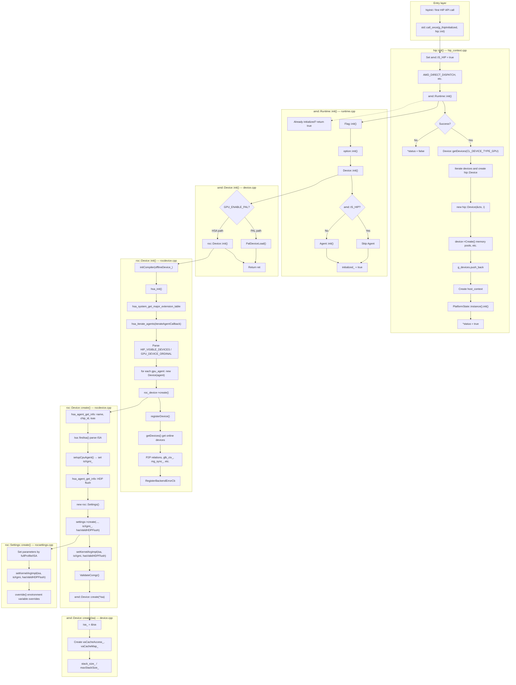

# 13/02 2026 - Yuechguo
# Agenda

<table>
<tr>
<td style="vertical-align:middle">
• HIP Runtime(CLR : Compute Language Runtimes)<br>
• ROCR(AMD's implementation of HSA runtime)<br>
• Debug Guide for ROCM runtimes
</td>
<td style="text-align:center; vertical-align:middle; padding:0 1em">→</td>
<td style="vertical-align:middle">
Functional classification for ROCM runtimes and summary of debugging experiences
</td>
</tr>
</table>

CLR : AMD compute language runtimes
HSA: Heterogeneous System Architecture

The ROCm runtime (ROCR) is AMD’s implementation of HSA runtime.This ROCm:
- The HSA Runtime (hsa-runtime) for AMD GPU application development
- The ROCt Thunk Library (libhsakmt), a "thunk" interface to the ROCm kernel driver (ROCk), used by the runtime.


# Functional classification for ROCM runtimes and summary of debugging experiences
## ROCM HIP Runtimes Initialization Process
| Module        | File Path                                                                   |
| ------------- | -------------------------------------------------------------------------- |
| HIP entry / context | `hipamd/src/hip_context.cpp`, `hip_table_interface.cpp`, `hip_internal.hpp` |
| Runtime       | `rocclr/platform/runtime.cpp`                                              |
| Flags/Options | `rocclr/utils/flags.cpp`, `rocclr/utils/options.cpp`                       |
| Device abstraction | `rocclr/device/device.cpp`, `rocclr/device/device.hpp`                   |
| ROCm device   | `rocclr/device/rocm/rocdevice.cpp`, `rocdevice.hpp`                        |
| ROCm settings | `rocclr/device/rocm/rocsettings.cpp`, `rocsettings.hpp`                    |
| HIP device    | `hipamd/src/hip_device.cpp`                                                |

```
hipInit / first API call
  → hip::init()
      → amd::Runtime::init()
          → Flag::init()
          → option::init()
          → Device::init()
              → roc::Device::init()
                  → hsa_init()
                  → hsa_iterate_agents()
                  → for each GPU agent:
                      → new roc::Device(agent)  // for AMD MI gpus, always call roc::Device::Init() 
                      → roc::Device::create()
                          → setupCpuAgent()  // isXgmi_
                          → new Settings(); settings->create(..., isXgmi_, hasValidHDPFlush)
                          → setKernelArgImpl()
                          → amd::Device::create(isa) // will call ROCR Init
                      → registerDevice()
                  → P2P, glb_ctx_, mg_sync_
          → [OpenCL] Agent::init()
      → Device::getDevices()
      → for each device: new hip::Device(), Create(), g_devices.push_back
      → host_context, PlatformState::instance().init()
```
粗略的对应，可以看到的device_id对应一个agent, agent初始化的时候，主要通过rocminfo拿到对应agent id等信息.
agent是rocr和kfd交互的最小device的颗粒，内存的创建，管理，信号的管理都以agent实例为基础.

## ROCR Signals and Events
### What is Signals and Events
在 HSA/ROCR 里，Signal 表示一个可被多端共享的、带内存序语义的整型“信号值”，用来做：
`同步：`一端改值（store），另一端按条件等待（wait）或被异步唤醒
`完成通知：`例如 kernel 完成、DMA 完成、队列异常等，用“值变化”表示完成
`依赖/事件：`AQL 包里的 completion_signal、异步拷贝的完成信号、队列的exception_signal 等

每一个Signal中都包含有一个对应的Event，Event的作用是通过KFD驱动和GPU上CP打交道，下面以InterruptSignal为例子说明：
`interrupt_signal.h and interrupt_signal.cpp`
```c++
class InterruptSignal : private LocalSignal, public Signal {
 public:
  class EventPool {
   public:
    struct Deleter {
      void operator()(HsaEvent* evt) { InterruptSignal::DestroyEvent(evt); }
    };
    using unique_event_ptr = ::std::unique_ptr<HsaEvent, Deleter>;

    EventPool() : allEventsAllocated(false) {}

    HsaEvent* alloc();
    void free(HsaEvent* evt);
    void clear() {
      events_.clear();
      allEventsAllocated = false;
    }

   private:
    HybridMutex lock_;
    std::vector<unique_event_ptr> events_;
    bool allEventsAllocated;
  };

  static HsaEvent* CreateEvent(HSA_EVENTTYPE type, bool manual_reset);
  static void DestroyEvent(HsaEvent* evt);

  /// @brief Determines if a Signal* can be safely converted to an
  /// InterruptSignal* via static_cast.
  static __forceinline bool IsType(Signal* ptr) {
    return ptr->IsType(&rtti_id());
  }

  explicit InterruptSignal(hsa_signal_value_t initial_value,
                           HsaEvent* use_event = NULL);

  ~InterruptSignal();
...
 private:
  /// @variable KFD event on which the interrupt signal is based on.
  // 每个信号对应一个event事件
  HsaEvent* event_;
...
}

InterruptSignal::InterruptSignal(hsa_signal_value_t initial_value, HsaEvent* use_event)
    : LocalSignal(initial_value, false), Signal(signal()) {
  if (use_event != nullptr) {
    event_ = use_event;
    free_event_ = false;
  } else {
    event_ = Runtime::runtime_singleton_->GetEventPool()->alloc();
    free_event_ = true;
  }

  if (event_ != nullptr) {
    signal_.event_id = event_->EventId;
    signal_.event_mailbox_ptr = event_->EventData.HWData2;
  } else {
    signal_.event_id = 0;
    signal_.event_mailbox_ptr = 0;
  }
  signal_.kind = AMD_SIGNAL_KIND_USER;
}

HsaEvent* InterruptSignal::CreateEvent(HSA_EVENTTYPE type, bool manual_reset) {
  HsaEventDescriptor event_descriptor;
  event_descriptor.EventType = type;
  event_descriptor.SyncVar.SyncVar.UserData = NULL;
  event_descriptor.SyncVar.SyncVarSize = sizeof(hsa_signal_value_t);
  event_descriptor.NodeId = 0;

  HsaEvent* ret = NULL;
  if (HSAKMT_STATUS_SUCCESS ==
      HSAKMT_CALL(hsaKmtCreateEvent(&event_descriptor, manual_reset, false, &ret))) {
    if (type == HSA_EVENTTYPE_MEMORY) {
      memset(&ret->EventData.EventData.MemoryAccessFault.Failure, 0,
             sizeof(HsaAccessAttributeFailure));
    } else if (type == HSA_EVENTTYPE_HW_EXCEPTION) {
      memset(&ret->EventData.EventData.HwException, 0, sizeof(HsaHwException));
    }
  }

  return ret;
}
```
hsaKmtCreateEvent是ROCR和KFD驱动交互的函数，通过Linux内核方法ioctl用来设定event到驱动的地址中.
```c++
HSAKMT_STATUS HSAKMTAPI hsaKmtCreateEvent(HsaEventDescriptor *EventDesc,
					  bool ManualReset, bool IsSignaled,
					  HsaEvent **Event)
{
	unsigned int event_limit = KFD_SIGNAL_EVENT_LIMIT;

	CHECK_KFD_OPEN();

	if (EventDesc->EventType >= HSA_EVENTTYPE_MAXID)
		return HSAKMT_STATUS_INVALID_PARAMETER;

	HsaEvent *e = malloc(sizeof(HsaEvent));

	if (!e)
		return HSAKMT_STATUS_ERROR;

	memset(e, 0, sizeof(*e));

	struct kfd_ioctl_create_event_args args = {0};

	args.event_type = EventDesc->EventType;
	args.node_id = EventDesc->NodeId;
	args.auto_reset = !ManualReset;

	/* dGPU code */
	pthread_mutex_lock(&hsakmt_mutex);

	if (hsakmt_is_dgpu && !events_page) {
		events_page = hsakmt_allocate_exec_aligned_memory_gpu(
			KFD_SIGNAL_EVENT_LIMIT * 8, PAGE_SIZE, 0, 0, true, false, true);
		if (!events_page) {
			free(e);
			pthread_mutex_unlock(&hsakmt_mutex);
			return HSAKMT_STATUS_ERROR;
		}
		if (hsakmt_use_model)
			model_set_event_page(events_page, KFD_SIGNAL_EVENT_LIMIT);
		else
			hsakmt_fmm_get_handle(events_page, (uint64_t *)&args.event_page_offset);
	}

	if (hsakmt_ioctl(hsakmt_kfd_fd, AMDKFD_IOC_CREATE_EVENT, &args) != 0) {
		free(e);
		*Event = NULL;
		pthread_mutex_unlock(&hsakmt_mutex);
		return HSAKMT_STATUS_ERROR;
	}

	e->EventId = args.event_id;

	if (!events_page && args.event_page_offset > 0) {
		events_page = mmap(NULL, event_limit * 8, PROT_WRITE | PROT_READ,
				MAP_SHARED, hsakmt_kfd_fd, args.event_page_offset);
		if (events_page == MAP_FAILED) {
			/* old kernels only support 256 events */
			event_limit = 256;
			events_page = mmap(NULL, PAGE_SIZE, PROT_WRITE | PROT_READ,
					   MAP_SHARED, hsakmt_kfd_fd, args.event_page_offset);
		}
		if (events_page == MAP_FAILED) {
			events_page = NULL;
			pthread_mutex_unlock(&hsakmt_mutex);
			hsaKmtDestroyEvent(e);
			return HSAKMT_STATUS_ERROR;
		}
	}

	if (args.event_page_offset > 0 && args.event_slot_index < event_limit)
		e->EventData.HWData2 = (HSAuint64)&events_page[args.event_slot_index];

        pthread_mutex_unlock(&hsakmt_mutex);

        e->EventData.EventType = EventDesc->EventType;
        e->EventData.HWData1 = args.event_id;

	e->EventData.HWData3 = args.event_trigger_data;
	e->EventData.EventData.SyncVar.SyncVar.UserData =
		EventDesc->SyncVar.SyncVar.UserData;
	e->EventData.EventData.SyncVar.SyncVarSize =
		EventDesc->SyncVar.SyncVarSize;

	if (IsSignaled && !IsSystemEventType(e->EventData.EventType)) {
		struct kfd_ioctl_set_event_args set_args = {0};

		set_args.event_id = args.event_id;

                if (hsakmt_ioctl(hsakmt_kfd_fd, AMDKFD_IOC_SET_EVENT,
                                 &set_args) != 0) {
                  hsaKmtDestroyEvent(e);
                  return HSAKMT_STATUS_ERROR;
                }
        }

        *Event = e;

	return HSAKMT_STATUS_SUCCESS;
}
```
一个Signal核心的成员变量的定义(`amd_hsa_signal.h`)：
```c++
typedef int64_t amd_signal_kind64_t;
enum amd_signal_kind_t {
  AMD_SIGNAL_KIND_INVALID = 0,
  AMD_SIGNAL_KIND_USER = 1,
  AMD_SIGNAL_KIND_DOORBELL = -1,
  AMD_SIGNAL_KIND_LEGACY_DOORBELL = -2
};

// AMD Signal.
#define AMD_SIGNAL_ALIGN_BYTES 64
#define AMD_SIGNAL_ALIGN __ALIGNED__(AMD_SIGNAL_ALIGN_BYTES)
typedef struct AMD_SIGNAL_ALIGN amd_signal_s {
  amd_signal_kind64_t kind;
  union {
    volatile int64_t value;
    volatile uint64_t* hardware_doorbell_ptr;
  };
  uint64_t event_mailbox_ptr;
  uint32_t event_id;
  uint32_t reserved1;
  uint64_t start_ts;
  uint64_t end_ts;
  union {
    amd_queue_v2_t* queue_ptr;
    uint64_t reserved2;
  };
  uint32_t reserved3[2];
} amd_signal_t;
```
Signal作为AMD_SIGNAL_KIND_USER的时候，第二个int64的值表示的vaule，这个通常是判断Signal状态的关键.

### How to Debug Signals
https://github.com/Yuechguo/debug_tools/tree/main/rocgdb_info
在定位阿里广告soft-hang的时候，发现某一个queue上的总有未完成的packet，可以通过packet找到对应的signal的位置，并分析singal中的成员变量的值.
```
(gdb) info queue
  Id   Target Id                  Type         Read   Write  Size     Address            
  1    AMDGPU Queue 4:1 (QID 27)  DMA                        1048576  0x00007e4b57600000 
  2    AMDGPU Queue 4:2 (QID 26)  DMA                        1048576  0x00007e4b57800000 
  3    AMDGPU Queue 3:3 (QID 25)  DMA                        1048576  0x00007e4b58200000 
  4    AMDGPU Queue 3:4 (QID 24)  DMA                        1048576  0x00007e4b58400000 
  5    AMDGPU Queue 2:5 (QID 23)  DMA                        1048576  0x00007e4b58e00000 
  6    AMDGPU Queue 2:6 (QID 22)  DMA                        1048576  0x00007e4b59000000 
  7    AMDGPU Queue 1:7 (QID 21)  DMA                        1048576  0x00007e4b59a00000 
  8    AMDGPU Queue 1:8 (QID 20)  DMA                        1048576  0x00007e4b5c400000 
  9    AMDGPU Queue 4:9 (QID 19)  HSA          438427 438427 1048576  0x00007e4bb1a00000 
  10   AMDGPU Queue 4:10 (QID 18) HSA          481374 481374 1048576  0x00007e4bb2c00000 
  11   AMDGPU Queue 4:11 (QID 17) HSA          479194 479194 1048576  0x00007e4bb3a00000 
  12   AMDGPU Queue 4:12 (QID 16) HSA          423666 423666 1048576  0x00007e4bb5c00000 
  13   AMDGPU Queue 4:13 (QID 15) HSA          1588   1588   4096     0x00007f91cc714000 
  14   AMDGPU Queue 3:14 (QID 14) HSA          444298 444298 1048576  0x00007e4bb7600000 
  15   AMDGPU Queue 3:15 (QID 13) HSA          453365 453365 1048576  0x00007e4bb8800000 
  16   AMDGPU Queue 3:16 (QID 12) HSA          425246 425246 1048576  0x00007e4bbc000000 
  17   AMDGPU Queue 3:17 (QID 11) HSA          418775 418775 1048576  0x00007e4bbd200000 
  18   AMDGPU Queue 3:18 (QID 10) HSA          1592   1592   4096     0x00007f91cce98000 
  19   AMDGPU Queue 2:19 (QID 9)  HSA          444064 444064 1048576  0x00007e4bbec00000 
  20   AMDGPU Queue 2:20 (QID 8)  HSA          455545 455545 1048576  0x00007e4bbfe00000 
  21   AMDGPU Queue 2:21 (QID 7)  HSA          419029 419029 1048576  0x00007e4bc0c00000 
  22   AMDGPU Queue 2:22 (QID 6)  HSA          419071 419071 1048576  0x00007e4bc2e00000 
  23   AMDGPU Queue 2:23 (QID 5)  HSA          1580   1580   4096     0x00007f91cceda000 
  24   AMDGPU Queue 1:24 (QID 4)  HSA          438252 438252 1048576  0x00007e4bc4800000 
  25   AMDGPU Queue 1:25 (QID 3)  HSA          2569549 2569550 1048576  0x00007e4bc5a00000 
  26   AMDGPU Queue 1:26 (QID 2)  HSA          480617 480617 1048576  0x00007e4bc8600000 
  27   AMDGPU Queue 1:27 (QID 1)  HSA          4735680 4735680 1048576  0x00007e4bc9800000 
  28   AMDGPU Queue 1:28 (QID 0)  HSA          1660   1660   4096     0x00007f91ccf1c000 
  
(gdb) dump_hsa_queue 0x00007e4bc9800000  2569549 2569550 1048576
------------------------------
Packet #2293 at 0x7e47efe23d40: header=0x1503 (type=3, barrier=1, acquire=2, release=2)
Barrier Packet Fields:
  dep_signal[0]=0x0
  dep_signal[1]=0x0
  dep_signal[2]=0x0
  dep_signal[3]=0x0
  dep_signal[4]=0x0
  completion_signal=0x7e4cb57d3100

(gdb) dump_hsa_signal 0x7e4cb57d3100
Signal at 0x7e4cb57d3100:
Signal Fields:
  kind=user(1)
  value=1
  mailbox_ptr=0x7f8df84c37d8
  event_id=1787
  start_ts=257063712923241, end_ts=257063712923413
  queue_ptr=0x0

(gdb) modify_hsa_signal 0x7e4cb57d3100 0
Signal Fields:
  kind=user(1)
  value=1
  mailbox_ptr=0x7f8df84c37d8
  event_id=1787
  start_ts=257063712923241, end_ts=257063712923413
  queue_ptr=0x0
  Modified signal at 0x7e4cb57d3100 - value changed from 1 to 0
```

## ROCR GPU System Error(VMFaultHandler and HwExceptionHandler) and Runtime AqlQueue Error
### Error Definition and Code Path
| Type | Scope | Handles | Registration entry |
|------|-------|---------|---------------------|
| **VMFaultHandler** | Process-level (Runtime) | Memory access errors (VM fault) | `Runtime::BindErrorHandlers()` |
| **HwExceptionHandler** | Process-level (Runtime) | Hardware exceptions (ECC, GPU Hang, etc.) | `Runtime::BindErrorHandlers()` |
| **AqlQueue::ExceptionHandler** | Per-queue | KFD queue exceptions (wave abort/trap, illegal instruction, memory violation, etc.) | When AqlQueue is constructed |
| **Custom system event callback** | Process-level | User callback invoked from VMFault/HwException internally | `hsa_amd_register_system_event_handler` |
---
#### VMFaultHandler (memory access errors)
- **Definition**: `Runtime::VMFaultHandler` (`runtime.cpp`)
- **When registered**: When `BindErrorHandlers()` is called during Runtime initialization.
- **Registration path**:
  1. `Runtime` calls `BindErrorHandlers()` at the end of initialization (around line 2059).
  2. Inside `BindErrorHandlers()`:
     - Create `HSA_EVENTTYPE_MEMORY` event → `vm_fault_event_`.
     - Use it to create `InterruptSignal` → `vm_fault_signal_`.
     - Call  
       `SetAsyncSignalHandler(Convert(vm_fault_signal_), HSA_SIGNAL_CONDITION_NE, 0, VMFaultHandler, vm_fault_signal_)`.

- **Underlying mechanism**: `SetAsyncSignalHandler` adds (signal, condition, value, handler, arg) to the async event list; the **AsyncEventsLoop** thread calls `VMFaultHandler` when the condition is met. VM fault comes from KFD's `HSA_EVENTTYPE_MEMORY` event.

```text
Runtime initialization
  → BindErrorHandlers()
      → CreateEvent(HSA_EVENTTYPE_MEMORY) → vm_fault_signal_
      → SetAsyncSignalHandler(vm_fault_signal_, ..., VMFaultHandler, arg)
```
---
#### HwExceptionHandler (hardware exceptions)
- **Definition**: `Runtime::HwExceptionHandler` (`runtime.cpp`)
- **When registered**: Same as VMFault, inside `BindErrorHandlers()`.
- **Registration path**:
  1. In the same `BindErrorHandlers()`:
     - Create `HSA_EVENTTYPE_HW_EXCEPTION` event → `hw_exception_event_`.
     - Use it to create `InterruptSignal` → `hw_exception_signal_`.
     - Call  
       `SetAsyncSignalHandler(Convert(hw_exception_signal_), HSA_SIGNAL_CONDITION_NE, 0, HwExceptionHandler, hw_exception_signal_)`.

- **Behavior summary**: Extract `HsaHwException` from the event (e.g. NodeId, ResetCause: ECC / GPU Hang). If callbacks registered via `SetCustomSystemEventHandler` exist, invoke them first; otherwise log error and `assert`/`abort`.

```text
Runtime initialization
  → BindErrorHandlers()
      → CreateEvent(HSA_EVENTTYPE_HW_EXCEPTION) → hw_exception_signal_
      → SetAsyncSignalHandler(hw_exception_signal_, ..., HwExceptionHandler, arg)
```
---

```c++
void Runtime::BindErrorHandlers() {
  if (!core::g_use_interrupt_wait || gpu_agents_.empty()) return;

  // Create memory event with manual reset to avoid racing condition
  // with driver in case of multiple concurrent VM faults.
  vm_fault_event_ = core::InterruptSignal::CreateEvent(HSA_EVENTTYPE_MEMORY, true);

  // Create an interrupt signal object to contain the memory event.
  // This signal object will be registered with the async handler global
  // thread.
  vm_fault_signal_ = new core::InterruptSignal(0, vm_fault_event_);

  if (!vm_fault_signal_->IsValid() || vm_fault_signal_->EopEvent() == NULL) {
    assert(false && "Failed on creating VM fault signal");
    return;
  }

  SetAsyncSignalHandler(core::Signal::Convert(vm_fault_signal_), HSA_SIGNAL_CONDITION_NE, 0,
                        VMFaultHandler, reinterpret_cast<void*>(vm_fault_signal_));

  // Create HW exception event which is for Non-RAS events
  hw_exception_event_ = core::InterruptSignal::CreateEvent(HSA_EVENTTYPE_HW_EXCEPTION, true);

  hw_exception_signal_ = new core::InterruptSignal(0, hw_exception_event_);

  if (!hw_exception_signal_->IsValid() || hw_exception_signal_->EopEvent() == NULL) {
    assert(false && "Failed on creating HW Exception signal");
    return;
  }

  SetAsyncSignalHandler(core::Signal::Convert(hw_exception_signal_), HSA_SIGNAL_CONDITION_NE, 0,
                        HwExceptionHandler, reinterpret_cast<void*>(hw_exception_signal_));
}
```
When ROCR starts, it automatically registers two types of exception signals: VM error and HW error. When `SetAsyncSignalHandler` is called, it creates a signal and a resident thread for each error handler. The resident thread is used to detect whether the signal is triggered; once triggered, it invokes the corresponding handler.

---
#### Custom system event callback
- **注册 API**：`hsa_amd_register_system_event_handler(callback, data)`  
  实现中对应 `Runtime::SetCustomSystemEventHandler`（`runtime.cpp`）。
- **注册方式**：不直接绑定到某个 signal，而是把 `(callback, data)` 存入 `Runtime::system_event_handlers_` 列表。
- **调用时机**：在 **VMFaultHandler** 或者**HwExceptionHandler**内部，会调用 `GetSystemEventHandlers()` 取回列表，对每个已注册的 callback 传入封装好的事件（如 `hsa_amd_event_t`，含 HW exception 信息）并调用。  
用户可以使用自己定义的system event 回调函数，阻塞系统**VMFaultHandler** 或者 **HwExceptionHandler**的执行，先执行用户自己的函数，可以用来保存某些重要信息，分析使用等.
---
#### AqlQueue::ExceptionHandler
- **Definition**: `AqlQueue::ExceptionHandler` (`amd_aql_queue.cpp`)
- **When registered**: When each AQL queue is **constructed/activated** (registered only when `KfdVersion().supports_exception_debugging == true`).
- **Registration path**:
  1. In the `AqlQueue` constructor, after `exception_signal_` etc. are initialized:
     - Call  
       `hsa_amd_signal_async_handler(exception_signal_, HSA_SIGNAL_CONDITION_NE, 0, ExceptionHandler, this)`.  
  2. `hsa_amd_signal_async_handler` internally calls `Runtime::SetAsyncSignalHandler`, so it is also async listening with "signal + condition + callback".

- **Condition**: Registered only when `core::Runtime::runtime_singleton_->KfdVersion().supports_exception_debugging` is true; otherwise only `DynamicQueueEventsHandler` is registered and `exceptionState = ERROR_HANDLER_DONE` (KFD queue exceptions not handled).

- **Handles**: Map KFD queue error codes (e.g. EC_QUEUE_WAVE_ABORT, EC_QUEUE_WAVE_MEMORY_VIOLATION) to `hsa_status_t`, suspend the queue, and call that queue's `errors_callback_` (default can be `Queue::DefaultErrorHandler`).

```text
AqlQueue construction
  → if (KfdVersion().supports_exception_debugging)
      → hsa_amd_signal_async_handler(exception_signal_, ..., ExceptionHandler, this)
          → Runtime::SetAsyncSignalHandler(...)
```
---
### A Simple Case for GPU Error handler
在**VMFaultHandler**或者**HwExceptionHandler**中，最后都会调用abort(),既发生了GPU system error后，runtime的线程会自动的abort()引发进程中断.如果我们强制吧**VMFaultHandler**或者**HwExceptionHandler**中的abot()去掉，会发生什么？
`GPU system Error` 会变成 `Aqlqueue Error`

一旦某个某个queue（stream）上执行的kernel出现system error，KFD驱动会stop the word，暂停当前进程的所有的queue的dipatch执行，如果system error handler没有abort()，进程继续执行，KFD会返回对应queue上的执行错误信息，这个时候就变成了对应的queue error.
针对阿里广告需求的方案：
去除掉system error abort，把所有system error变成queue error；
当queue error发生的时候，首先调用用户的queue error handler；
用户的queue error handler保存当前queue（stream）上的一些关键信息后abort();
然后用户TF集成重启后过滤关键信息，防止出现TF进程拉起后反复出现coredump.
https://github.com/ROCm/clr/commits/yuechguo/rocm-6.3.x-ali_recoverable
https://github.com/ROCm/ROCR-Runtime/commits/yuechguo/rocm-6.3.x-ali_recoverable

---
## HIP Runtime Command and ScopedLock
Command是Hip runtime上的命令的基础类方法,用户的每一个runtime api的调用最后都会封装成一个Commnad指令.下面以一个hip memory copy为例说明：
`Command.hpp, Command.cpp`
```c++
hipError_t ihipMemcpy(void* dst, const void* src, size_t sizeBytes, hipMemcpyKind kind,
                      hip::Stream& stream, bool isHostAsync, bool isGPUAsync) {
  hipError_t status;
  if (sizeBytes == 0) {
    // Skip if nothing needs writing.
    return hipSuccess;
  }
  status = ihipMemcpy_validate(dst, src, sizeBytes, kind);
  if (status != hipSuccess) {
    return status;
  }
  if (src == dst && kind == hipMemcpyDefault) {
    return hipSuccess;
  }
  size_t sOffset = 0;
  amd::Memory* srcMemory = getMemoryObject(src, sOffset);
  size_t dOffset = 0;
  amd::Memory* dstMemory = getMemoryObject(dst, dOffset);

  hipMemoryType srcMemoryType = getMemoryType(srcMemory);
  hipMemoryType dstMemoryType = getMemoryType(dstMemory);

  if (srcMemory == nullptr && dstMemory == nullptr) {
    ihipHtoHMemcpy(dst, src, sizeBytes, stream);
    return hipSuccess;
  } else if (((srcMemory == nullptr) && (dstMemory != nullptr)) ||
             ((srcMemory != nullptr) && (dstMemory == nullptr))) {
    // Unpinned copy wait behavior is enforced in the lower copy layers so skip
    // wait at top level except for MT path
    isHostAsync &= AMD_DIRECT_DISPATCH ? true : false;
  } else if (srcMemory->GetDeviceById() == dstMemory->GetDeviceById()) {
    // Device to Device copies do not need to host side synchronization.
    if ((srcMemoryType == hipMemoryTypeDevice) && (dstMemoryType == hipMemoryTypeDevice) &&
        (!srcMemory->getUserData().sync_mem_ops_ || !dstMemory->getUserData().sync_mem_ops_)) {
      isHostAsync = true;
    }
    // Any Host to any Host need host side synchronization.
    if ((srcMemoryType == hipMemoryTypeHost) && (dstMemoryType == hipMemoryTypeHost)) {
      isHostAsync = false;
    }
  }

  amd::Command* command = nullptr;
  status = ihipMemcpyCommand(command, dst, src, sizeBytes, kind, stream, isHostAsync);
  if (status != hipSuccess) {
    return status;
  }
  command->enqueue();
  if (!isHostAsync) {
    command->queue()->finishCommand(command);
  } else if (!isGPUAsync) {
    hip::Stream* pStream = hip::getNullStream(dstMemory->GetDeviceById()->context());
    amd::Command::EventWaitList waitList;
    waitList.push_back(command);
    amd::Command* depdentMarker = new amd::Marker(*pStream, false, waitList);
    if (depdentMarker != nullptr) {
      depdentMarker->enqueue();
      depdentMarker->release();
    }
  } else {
    amd::HostQueue* newQueue = command->queue();
    if (newQueue != &stream) {
      amd::Command::EventWaitList waitList;
      amd::Command* cmd = newQueue->getLastQueuedCommand(true);
      if (cmd != nullptr) {
        waitList.push_back(cmd);
        amd::Command* depdentMarker = new amd::Marker(stream, true, waitList);
        if (depdentMarker != nullptr) {
          depdentMarker->enqueue();
          depdentMarker->release();
        }
        cmd->release();
      }
    }
  }
  command->release();
  return hipSuccess;
}

---

class Command : public Event {
 private:
  static SysmemPool<ComputeCommand> *command_pool_;  //!< Pool of active commands
  HostQueue* queue_;               //!< The command queue this command is enqueue into
  Command* next_;                  //!< Next GPU command in the queue list
  Command* batch_head_ = nullptr;  //!< The head of the batch commands
  cl_command_type type_;           //!< This command's OpenCL type.
  std::vector<void*> data_;
  const Event* waitingEvent_;  //!< Waiting event associated with the marker
...
  //! Construct a new command of the given OpenCL type.
  Command(HostQueue& queue, cl_command_type type,
          const EventWaitList& eventWaitList = nullWaitList,
          uint32_t commandWaitBits = 0, const Event* waitingEvent = nullptr);
...
}
```
ihipMemcpyCommand 函数中会根据配置不同，申请不同类型的封装的copy类的Command，然后enqueue操作就是将当前的command转化为packet指令，push到对应的steam/queue上，每个命令结束后command的使命结束，然后释放（类似于智能指针的释放，不是真的mem free）.
生命周期结束后会调用delete：
```c++
void Command::operator delete(void* ptr) {
  if (DEBUG_CLR_SYSMEM_POOL) {
    command_pool_->Free(ptr);
  } else {
    ::operator delete (ptr);
  }
}

void* Command::operator new(size_t size) {
  if (DEBUG_CLR_SYSMEM_POOL) {
    return command_pool_->Alloc(size);
  } else {
    return ::operator new (size);
  }
}
```
DEBUG_CLR_SYSMEM_POOL为true的时候（默认为false），会调用内部的commmand_pool（`object.hpp`）来alloc和free对应的commnad.
```c++
template <class T>
class SysmemPool {
public:
  SysmemPool(): chunk_access_(true) /* Sysmem Pool Lock */ {}
...
  void* Alloc(size_t size) {
    guarantee(size <= sizeof(T), "Bigger size than pool allows!");
    size_t current = current_alloc_++;
    auto idx = current / kAllocChunkSize;
    while (idx >= max_chunk_idx_) {
      ScopedLock lock(chunk_access_);
      // Second check in a case of multiple waiters
      if (idx == max_chunk_idx_) {
        auto allocs = new MemoryObject[kAllocChunkSize];
        // Save the base in the first slot of all allocations
        allocs[0].base_ = new AllocChunk(allocs);
        // Check if the overwritten chunk has still empty slots
        if (active_allocs_[idx % kActiveAllocSize] != nullptr) {
          auto stale = active_allocs_[idx % kActiveAllocSize]->base_;
          if (stale->busy_ != kAllocChunkSize) {
            // The pool contains the stale slots, hence make sure it's marked as free
            auto freed = stale->free_ - stale->busy_;
            if (freed == 0) {
              delete stale;
              free_chunk_num_++;
            }
          }
        }
        // Keep the chunk in the list of active chunks
        active_allocs_[idx % kActiveAllocSize] = allocs;
        max_chunk_idx_++;
      } else if ((idx < max_chunk_idx_) && ((max_chunk_idx_ - idx) >= kActiveAllocSize)) {
        // If a wait was very long, then drop the old slot and find a more recent one
        current = current_alloc_++;
        idx = current / kAllocChunkSize;
      }
    }

    // Find a slot in the active pool of allocations
    auto chunk_idx = idx % kActiveAllocSize;
    MemoryObject* obj = &active_allocs_[chunk_idx][current % kAllocChunkSize];
    // Save the chunk allocation
    obj->base_ = active_allocs_[chunk_idx]->base_;
    obj->base_->busy_++;
    return &obj->object_;
  }
...

private:
  static constexpr size_t kAllocChunkSize = 2048;  //!< The total number of allocations in a chunk
  static constexpr size_t kActiveAllocSize = 32;   //!< The number of active chunks
  struct AllocChunk;
  struct MemoryObject {
    AllocChunk* base_;      //!< The chunk information for this memory object
    T   object_;            //!< Allocated user object
    MemoryObject() {}
  };
  struct AllocChunk {
    MemoryObject* allocs_;        //! Array of allocations
    std::atomic<uint32_t> busy_;  //! The number of commands still available for usage
    std::atomic<uint32_t> free_;  //! The number of commands still available for usage
    AllocChunk(MemoryObject* alloc): allocs_(alloc), busy_(0), free_(kAllocChunkSize) {}
    ~AllocChunk() { delete [] allocs_; }
  };

  std::atomic<uint64_t> current_alloc_ = 0; //!< Current allocation, global index
  std::atomic<size_t> max_chunk_idx_ = 0;   //!< Current max chunk index
  size_t  free_chunk_num_ = 0;              //!< The number of freed chunks
  amd::Monitor  chunk_access_;              //!< Lock for the chunk list access
  MemoryObject* active_allocs_[kActiveAllocSize] = {}; //!< Active chunks for fast access
};
```
在command_pool中使用到了
```c++
// 以下是rocm6.3.x的hip runtime的代码
void Monitor::finishLock() {
  Thread* thread = Thread::current();
  assert(thread != NULL && "cannot lock() from (null)");

  if (trySpinLock()) {
    return;  // We succeeded, we are done.
  }

  /* The lock is contended. Push the thread's semaphore onto
   * the contention list.
   */
  Semaphore& semaphore = thread->lockSemaphore();
  semaphore.reset();

  LinkedNode newHead;
  newHead.setItem(&semaphore);

  intptr_t head = contendersList_.load(std::memory_order_acquire);
  for (;;) {
    // The assumption is that lockWord is locked. Make sure we do not
    // continue unless the lock bit is set.
    if ((head & kLockBit) == 0) {
      if (tryLock()) {
        return;
      }
      continue;
    }

    // Set the new contention list head if lockWord is unchanged.
    newHead.setNext(reinterpret_cast<LinkedNode*>(head & ~kLockBit));
    if (contendersList_.compare_exchange_weak(head, reinterpret_cast<intptr_t>(&newHead) | kLockBit,
                                              std::memory_order_acq_rel,
                                              std::memory_order_acquire)) {
      break;
    }

    // We failed the CAS. yield/pause before trying again.
    Thread::yield();
  }

  int32_t spinCount = 0;
  // Go to sleep until we become the on-deck thread.
  while ((onDeck_ & ~kLockBit) != reinterpret_cast<intptr_t>(&semaphore)) {
    // First, be SMT friendly
    if (spinCount < kMaxReadSpinIter) {
      Os::spinPause();
    }
    // and then SMP friendly
    else if (spinCount < kMaxSpinIter) {
      Thread::yield();
    }
    // now go to sleep
    else {
      semaphore.wait();
    }
    spinCount++;
  }

  spinCount = 0;
  //
  // From now-on, we are the on-deck thread. It will stay that way until
  // we successfuly acquire the lock.
  //
  for (;;) {
    assert((onDeck_ & ~kLockBit) == reinterpret_cast<intptr_t>(&semaphore) && "just checking");
    if (tryLock()) {
      break;
    }

    // Somebody beat us to it. Since we are on-deck, we can just go
    // back to sleep.
    // First, be SMT friendly
    if (spinCount < kMaxReadSpinIter) {
      Os::spinPause();
    }
    // and then SMP friendly
    else if (spinCount < kMaxSpinIter) {
      Thread::yield();
    }
    // now go to sleep
    else {
      semaphore.wait();
    }
    spinCount++;
  }

  assert(newHead.next() == NULL && "Should not be linked");
  onDeck_ = 0;
}
```
SopeLock在旧版本的实现，是通过单链表方式实现的，最先被阻塞的线程，会在链表的最尾端，这样的锁结构的时候，在大量thread commnad申请和释放时候会有一定概率导致commamd_pool的某个地址空间被重复使用，造成segement fault.
Debug Guide：
如果发现了hip runtime的版本是<=rocm6.4.x，DEBUG_CLR_SYSMEM_POOL=true的情况使用了command_pool，出现了在runtime或者rocr上的segement fault，建议关掉command_pool，设置DEBUG_CLR_SYSMEM_POOL=true
2.debug时候发现某些线程被锁定很长时间，建议更新hip-runtime的版本，最新的版本中SopeLock直接舍弃了原来的实现，采用了标准std的mutex（竞争锁）.

---
## HIP Stream Queue and Packet
### gpu_queue, aqlqueue and aqlpacket
Hip runtime的flag，GPU_MAX_HW_QUEUES描述的是在hip clr和rocr这一层创建的gpu_queue（对应的是rocr中的Aqlqueue）的数量，而不是真实的存在GPU上的HW的QUEUE的数量.
hip rumtimes上默认有3个不同的gpu_queue level，QueuePriority::Low，QueuePriority::Normal和QueuePriority::High，默认的level是QueuePriority::Normal.

`hip-clr rocdevice.cpp`
```c++
release(uint, GPU_MAX_HW_QUEUES, 4,"The maximum number of HW queues allocated per device")

hsa_queue_t* Device::acquireQueue(uint32_t queue_size_hint, bool coop_queue,
                                  const std::vector<uint32_t>& cuMask,
                                  amd::CommandQueue::Priority priority,
                                  bool managed) {
  amd::ScopedLock l(active_queue_access_);

  assert(queuePool_[QueuePriority::Low].size() <= GPU_MAX_HW_QUEUES ||
         queuePool_[QueuePriority::Normal].size() <= GPU_MAX_HW_QUEUES ||
         queuePool_[QueuePriority::High].size() <= GPU_MAX_HW_QUEUES);

  hsa_amd_queue_priority_t queue_priority;
  uint qIndex;
  switch (priority) {
    case amd::CommandQueue::Priority::Low:
      queue_priority = HSA_AMD_QUEUE_PRIORITY_LOW;
      qIndex = QueuePriority::Low;
      break;
    case amd::CommandQueue::Priority::High:
      queue_priority = HSA_AMD_QUEUE_PRIORITY_HIGH;
      qIndex = QueuePriority::High;
      break;
    case amd::CommandQueue::Priority::Normal:
    case amd::CommandQueue::Priority::Medium:
    default:
      queue_priority = HSA_AMD_QUEUE_PRIORITY_NORMAL;
      qIndex = QueuePriority::Normal;
      break;
  }
  
  // If we have reached the max number of queues, reuse an existing queue with the matching queue priority,
  // choosing the one with the least number of users.
  // Note: Don't attempt to reuse the cooperative queue, since it's single per device
  if (!coop_queue && (cuMask.size() == 0) &&
      ((queuePool_[qIndex].size() == GPU_MAX_HW_QUEUES) || queuePool_[qIndex].size() > 0)) {
    hsa_queue_t* queue = getQueueFromPool(qIndex);
    if (queue != nullptr) {
      if (!managed && (qIndex  == QueuePriority::Normal)) {
        num_normal_queues_++;
      }
      return queue;
    }
  }

  // Else create a new queue. This also includes the initial state where there
  // is no queue.
  uint32_t queue_max_packets = 0;
  if (HSA_STATUS_SUCCESS !=
      hsa_agent_get_info(bkendDevice_, HSA_AGENT_INFO_QUEUE_MAX_SIZE, &queue_max_packets)) {
    DevLogError("Cannot get hsa agent info \n");
    return nullptr;
  }
  auto queue_size = (queue_max_packets < queue_size_hint) ? queue_max_packets : queue_size_hint;

  hsa_queue_t* queue;
  auto queue_type = HSA_QUEUE_TYPE_MULTI;

  // Enable cooperative queue for the device queue
  if (coop_queue) {
    queue_type = HSA_QUEUE_TYPE_COOPERATIVE;
  }

  while (hsa_queue_create(bkendDevice_, queue_size, queue_type, callbackQueue, this,
                          std::numeric_limits<uint>::max(), std::numeric_limits<uint>::max(),
                          &queue) != HSA_STATUS_SUCCESS) {
    queue_size >>= 1;
    if (queue_size < 64) {
      // if a queue with the same requested priority available from the pool, returns it here
      if (!coop_queue && (cuMask.size() == 0) && (queuePool_[qIndex].size() > 0)) {
        return getQueueFromPool(qIndex);
      }
      DevLogError("Device::acquireQueue: hsa_queue_create failed!");
      return nullptr;
    }
  }

  auto result = queuePool_[qIndex].emplace(std::make_pair(queue, QueueInfo()));
  assert(result.second && "QueueInfo already exists");
  auto &qInfo = result.first->second;
  qInfo.refCount = 1;
  if (!managed && (cuMask.size() == 0) && (qIndex = QueuePriority::Normal)) {
    num_normal_queues_++;
  }
  return queue;
}

hsa_queue_t* Device::getQueueFromPool(const uint qIndex) {
  // Check if queue with refCount 0 is available to use
  if (queuePool_[qIndex].size() < GPU_MAX_HW_QUEUES) {
    for (auto& it : queuePool_[qIndex]) {
      if (it.second.refCount == 0) {
        it.second.refCount++;
        ClPrint(amd::LOG_INFO, amd::LOG_QUEUE, "Selected queue refCount: %p (%d)",
                it.first->base_address, it.second.refCount);
        return it.first;
      }
    }
  } else {
    if (qIndex < QueuePriority::Total && queuePool_[qIndex].size() > 0) {
      // Search through all available queues for the lowest counter.
      // Note: the map is sorted in the allocation order for possible round-robin selection
      typedef decltype(queuePool_)::value_type::const_reference PoolRef;
      auto lowest = std::min_element(
          queuePool_[qIndex].begin(), queuePool_[qIndex].end(),
          [](PoolRef A, PoolRef B) { return A.second.refCount < B.second.refCount; });
      lowest->second.refCount++;
      ClPrint(amd::LOG_INFO, amd::LOG_QUEUE, "Selected queue refCount: %p (%d)",
              lowest->first->base_address, lowest->second.refCount);
      return lowest->first;
    }
  }
  return nullptr;
}
```
gpu_queue创建模式是round-robin，当创建的gpu_queue的num == GPU_MAX_HW_QUEUES的时候，会重头开始映射,既从queue_pool_中拿出来一个queue的地址返回.
callbackQueue就是出现queue error（rocr 的Aqlqueue）的回调函数.
`rocr hsa.cpp amd_gpu_agent.cpp`
```c++
hsa_status_t hsa_queue_create(
    hsa_agent_t agent_handle, uint32_t size, hsa_queue_type32_t type,
    void (*callback)(hsa_status_t status, hsa_queue_t* source, void* data),
    void* data, uint32_t private_segment_size, uint32_t group_segment_size,
    hsa_queue_t** queue) {
  IS_OPEN();

  if ((queue == nullptr) || (size == 0) || (!IsPowerOfTwo(size)) ||
      (type > HSA_QUEUE_TYPE_COOPERATIVE)) {
    return HSA_STATUS_ERROR_INVALID_ARGUMENT;
  }

  core::Agent* agent = core::Agent::Convert(agent_handle);
  IS_VALID(agent);

  hsa_queue_type32_t agent_queue_type = HSA_QUEUE_TYPE_MULTI;
  hsa_status_t status =
      agent->GetInfo(HSA_AGENT_INFO_QUEUE_TYPE, &agent_queue_type);
  assert(HSA_STATUS_SUCCESS == status);

  if ((agent_queue_type == HSA_QUEUE_TYPE_SINGLE) &&
      (type != HSA_QUEUE_TYPE_SINGLE)) {
    return HSA_STATUS_ERROR_INVALID_QUEUE_CREATION;
  }

  if (callback == nullptr) callback = core::Queue::DefaultErrorHandler;

  uint64_t queue_create_flags = 0;

  if (core::Runtime::runtime_singleton_->flag().dev_mem_queue_buf())
    queue_create_flags = HSA_AMD_QUEUE_CREATE_DEVICE_MEM_RING_BUF;

  core::Queue* cmd_queue = nullptr;
  status = agent->QueueCreate(size, type, queue_create_flags, callback, data, private_segment_size,
                              group_segment_size, &cmd_queue);
  if (status != HSA_STATUS_SUCCESS) return status;

  assert(cmd_queue != nullptr && "Queue not returned but status was success.\n");
  *queue = core::Queue::Convert(cmd_queue);
  return status;
}

hsa_status_t GpuAgent::QueueCreate(size_t size, hsa_queue_type32_t queue_type, uint64_t flags,
                                   core::HsaEventCallback event_callback, void* data,
                                   uint32_t private_segment_size, uint32_t group_segment_size,
                                   core::Queue** queue) {
...
  auto aql_queue = new AqlQueue(shared_queue, this, size, node_id(), scratch, event_callback, data,
                                flags);
  *queue = aql_queue;
  aql_queues_.push_back(aql_queue);

  if (doorbell_queue_map_) {
    // Calculate index of the queue doorbell within the doorbell aperture.
    auto doorbell_addr = uintptr_t(aql_queue->signal_.hardware_doorbell_ptr);
    auto doorbell_idx = (doorbell_addr >> 3) & (MAX_NUM_DOORBELLS - 1);
    doorbell_queue_map_[doorbell_idx] = &aql_queue->amd_queue_;
  }

  scratchGuard.Dismiss();
  return HSA_STATUS_SUCCESS;
}

AqlQueue::AqlQueue(core::SharedQueue* shared_queue, GpuAgent* agent, size_t req_size_pkts,
                   HSAuint32 node_id, ScratchInfo& scratch, core::HsaEventCallback callback,
                   void* err_data, uint64_t flags)
    : Queue(shared_queue, flags, !agent->is_xgmi_cpu_gpu()),
      LocalSignal(0, false),
      DoorbellSignal(signal()),
      ring_buf_(nullptr),
      ring_buf_alloc_bytes_(0),
      queue_id_(HSA_QUEUEID(-1)),
      active_(false),
      agent_(agent),
      queue_scratch_(scratch),
      errors_callback_(callback),
      errors_data_(err_data),
      pm4_ib_buf_(nullptr),
      pm4_ib_size_b_(0x1000),
      dynamicScratchState(0),
      exceptionState(0),
      suspended_(false),
      priority_(HSA_QUEUE_PRIORITY_NORMAL),
      exception_signal_(nullptr) {

  // Queue size is a function of several restrictions.
  const uint32_t min_pkts = ComputeRingBufferMinPkts();
  const uint32_t max_pkts = ComputeRingBufferMaxPkts();

  // Apply sizing constraints to the ring buffer.
  uint32_t queue_size_pkts = uint32_t(req_size_pkts);
  queue_size_pkts = Min(queue_size_pkts, max_pkts);
  queue_size_pkts = Max(queue_size_pkts, min_pkts);

  uint32_t queue_size_bytes = queue_size_pkts * sizeof(core::AqlPacket);
  if ((queue_size_bytes & (queue_size_bytes - 1)) != 0)
    throw AMD::hsa_exception(HSA_STATUS_ERROR_INVALID_QUEUE_CREATION,
                             "Requested queue with non-power of two packet capacity.\n");

  // Allocate the AQL packet ring buffer.
  AllocRegisteredRingBuffer(queue_size_pkts);
  if (ring_buf_ == nullptr) throw std::bad_alloc();
  MAKE_NAMED_SCOPE_GUARD(RingGuard, [&]() { FreeQueueMemory(); });

  // Fill the ring buffer with invalid packet headers.
  // Leave packet content uninitialized to help track errors.
  for (uint32_t pkt_id = 0; pkt_id < queue_size_pkts; ++pkt_id) {
    (((core::AqlPacket*)ring_buf_)[pkt_id]).dispatch.header = HSA_PACKET_TYPE_INVALID;
  }

  // Zero the amd_queue_ structure to clear RPTR/WPTR before queue attach.
  memset(&amd_queue_, 0, sizeof(amd_queue_));

  // Initialize and map a HW AQL queue.
  HsaQueueResource queue_rsrc = {0};
  queue_rsrc.Queue_read_ptr_aql = (uint64_t*)&amd_queue_.read_dispatch_id;

  // Hardware write pointer supports AQL semantics.
  queue_rsrc.Queue_write_ptr_aql = (uint64_t*)&amd_queue_.write_dispatch_id;

  // Populate amd_queue_ structure.
  amd_queue_.hsa_queue.type = HSA_QUEUE_TYPE_MULTI;
  amd_queue_.hsa_queue.features = HSA_QUEUE_FEATURE_KERNEL_DISPATCH;
  amd_queue_.hsa_queue.base_address = ring_buf_;
  amd_queue_.hsa_queue.doorbell_signal = Signal::Convert(this);
  amd_queue_.hsa_queue.size = queue_size_pkts;
  amd_queue_.hsa_queue.id = INVALID_QUEUEID;
  amd_queue_.read_dispatch_id_field_base_byte_offset = uint32_t(
      uintptr_t(&amd_queue_.read_dispatch_id) - uintptr_t(&amd_queue_));
  // Initialize the doorbell signal structure.
  memset(&signal_, 0, sizeof(signal_));
  signal_.kind = AMD_SIGNAL_KIND_DOORBELL;
  signal_.hardware_doorbell_ptr = nullptr;
  signal_.queue_ptr = &amd_queue_;

  const auto& props = agent->properties();
  amd_queue_.max_cu_id = (props.NumFComputeCores / props.NumSIMDPerCU) - 1;
  amd_queue_.max_wave_id = (props.MaxWavesPerSIMD * props.NumSIMDPerCU) - 1;
...
}
```
hip runtime中的gpu_queue和rocr中的Aqlqueue是一一对应的关系，Aqlqueue的ring_buf是定义的packet存放地方，amd_queue_定义的是一个AMD queue的结构实体.
`rocr queue.h amd_hsa_queue.h`
```c++
struct AqlPacket {
  union {
    struct {
      uint16_t header;
      struct {
        uint8_t user_data[62];
      } body;
     } packet;
    struct {
      uint16_t header;
      uint8_t format;
      uint8_t rest[61];
    } amd_vendor;
    hsa_kernel_dispatch_packet_t dispatch;
    hsa_barrier_and_packet_t barrier_and;
    hsa_barrier_or_packet_t barrier_or;
    hsa_agent_dispatch_packet_t agent;
  };
...
}
typedef struct hsa_kernel_dispatch_packet_s {
  union {
    struct {
        uint16_t header;
        uint16_t setup;
    };
    uint32_t full_header;
  };

  uint16_t workgroup_size_x;
  uint16_t workgroup_size_y;

  uint16_t workgroup_size_z;

  uint16_t reserved0;
  uint32_t grid_size_x;
  uint32_t grid_size_y;
  uint32_t grid_size_z;

  uint32_t private_segment_size;
  uint32_t group_segment_size;
  uint64_t kernel_object;

#ifdef HSA_LARGE_MODEL
  void* kernarg_address;
#elif defined HSA_LITTLE_ENDIAN
  void* kernarg_address;
  uint32_t reserved1;
#else
  uint32_t reserved1;
  void* kernarg_address;
#endif
  uint64_t reserved2;
  hsa_signal_t completion_signal;

} hsa_kernel_dispatch_packet_t;

typedef struct hsa_queue_s {
  hsa_queue_type32_t type;
  uint32_t features;
#ifdef HSA_LARGE_MODEL
  void* base_address; // point to ring_buf_
#elif defined HSA_LITTLE_ENDIAN
  void* base_address; // point to ring_buf_
  uint32_t reserved0;
#else
  uint32_t reserved0;
  void* base_address;
#endif
  hsa_signal_t doorbell_signal;
  uint32_t size;
  uint32_t reserved1;
  uint64_t id;
} hsa_queue_t;

typedef struct AMD_QUEUE_ALIGN amd_queue_v2_s {
  hsa_queue_t hsa_queue;
  uint32_t caps;
  uint32_t reserved1[3];
  volatile uint64_t write_dispatch_id; // every dispatch on this queue will ++
  uint32_t group_segment_aperture_base_hi;
  uint32_t private_segment_aperture_base_hi;
  uint32_t max_cu_id;
  uint32_t max_wave_id;
  volatile uint64_t max_legacy_doorbell_dispatch_id_plus_1;
  volatile uint32_t legacy_doorbell_lock;
  uint32_t reserved2[9];
  volatile uint64_t read_dispatch_id; // every exec packet by cp will ++
  uint32_t read_dispatch_id_field_base_byte_offset;
  uint32_t compute_tmpring_size;
  uint32_t scratch_resource_descriptor[4];
  uint64_t scratch_backing_memory_location;
  uint64_t scratch_backing_memory_byte_size;
  uint32_t scratch_wave64_lane_byte_size;
  amd_queue_properties32_t queue_properties;
  volatile uint64_t scratch_max_use_index;       /* V2 */
  hsa_signal_t queue_inactive_signal;
  volatile uint64_t alt_scratch_max_use_index;  /* V2 */
  uint32_t alt_scratch_resource_descriptor[4];   /* V2 */
  uint64_t alt_scratch_backing_memory_location;  /* V2 */
  uint32_t alt_scratch_dispatch_limit_x;         /* V2 */
  uint32_t alt_scratch_dispatch_limit_y;         /* V2 */
  uint32_t alt_scratch_dispatch_limit_z;         /* V2 */
  uint32_t alt_scratch_wave64_lane_byte_size;    /* V2 */
  uint32_t alt_compute_tmpring_size;             /* V2 */
  uint32_t reserved5;

  scratch_last_used_index_xcc_t scratch_last_used_index[MAX_NUM_XCC];
} amd_queue_v2_t;
```
amd_queue_部分变脸地址会通过KFD驱动映射给GPU CP processor.建立起hip clr的queue到rocr Aqlqueue 到驱动KFD的queue的一一映射关系.
```c++
typedef struct _HsaQueueResource
{
    HSA_QUEUEID     QueueId;    /** queue ID */
    /** Doorbell address to notify HW of a new dispatch */
    union
    {
        HSAuint32*  Queue_DoorBell;
        HSAuint64*  Queue_DoorBell_aql;
        HSAuint64   QueueDoorBell;
    };

    /** virtual address to notify HW of queue write ptr value */
    union
    {
        HSAuint32*  Queue_write_ptr;
        HSAuint64*  Queue_write_ptr_aql;
        HSAuint64   QueueWptrValue;
    };

    /** virtual address updated by HW to indicate current read location */
    union
    {
        HSAuint32*  Queue_read_ptr;
        HSAuint64*  Queue_read_ptr_aql;
        HSAuint64   QueueRptrValue;
    };

    volatile HSAint64* ErrorReason;  /** exception bits signal payload */
} HsaQueueResource;

HsaQueueResource queue_rsrc = {0};
queue_rsrc.Queue_read_ptr_aql = (uint64_t*)&amd_queue_.read_dispatch_id;

// Hardware write pointer supports AQL semantics.
queue_rsrc.Queue_write_ptr_aql = (uint64_t*)&amd_queue_.write_dispatch_id;

hsa_status_t status;
if (core::Runtime::runtime_singleton_->KfdVersion().supports_exception_debugging) {
  queue_rsrc.ErrorReason = &exception_signal_->signal_.value;
  status =
      agent->driver().CreateQueue(node_id, HSA_QUEUE_COMPUTE_AQL, 100, priority_, 0, ring_buf_,
                                  ring_buf_alloc_bytes_, queue_event(), queue_rsrc);
} else {
  status = agent->driver().CreateQueue(node_id, HSA_QUEUE_COMPUTE_AQL, 100, priority_, 0,
                                        ring_buf_, ring_buf_alloc_bytes_, NULL, queue_rsrc);
}
if (status != HSA_STATUS_SUCCESS)
  throw AMD::hsa_exception(HSA_STATUS_ERROR_OUT_OF_RESOURCES,
                            "Queue create failed\n");
// Complete populating the doorbell signal structure.
signal_.hardware_doorbell_ptr = queue_rsrc.Queue_DoorBell_aql;

// Bind Id of Queue such that is unique i.e. it is not re-used by another
// queue (AQL, HOST) in the same process during its lifetime.
amd_queue_.hsa_queue.id = this->GetQueueId();

queue_id_ = queue_rsrc.QueueId;
```
### hip steam and hip queue
`clr hip_stream.cpp hip_internal.hpp`
```c++
static hipError_t ihipStreamCreate(hipStream_t* stream,
                                  unsigned int flags, hip::Stream::Priority priority,
                                  const std::vector<uint32_t>& cuMask = {}) {
  if (flags != hipStreamDefault && flags != hipStreamNonBlocking) {
    return hipErrorInvalidValue;
  }
  hip::Stream* hStream = new hip::Stream(hip::getCurrentDevice(), priority, flags, false, cuMask);

  if (hStream == nullptr) {
    return hipErrorOutOfMemory;
  }
  else if (!hStream->Create()) {
    hip::Stream::Destroy(hStream);
    return hipErrorOutOfMemory;
  }

  *stream = reinterpret_cast<hipStream_t>(hStream);

  return hipSuccess;
}

class Stream : public amd::HostQueue {
  public:
    enum Priority : int { High = -1, Normal = 0, Low = 1 };

  private:
    mutable amd::Monitor lock_;
    Device* device_;
    Priority priority_;
...
  public:
    Stream(Device* dev, Priority p = Priority::Normal, unsigned int f = 0, bool null_stream = false,
           const std::vector<uint32_t>& cuMask = {},
           hipStreamCaptureStatus captureStatus = hipStreamCaptureStatusNone);
...
}

class HostQueue : public CommandQueue {
  class Thread : public amd::Thread {
   public:
    //! True if this command queue thread is accepting commands.
    volatile bool acceptingCommands_;

    //! Create a new thread
    Thread()
        : amd::Thread("Command Queue Thread", CQ_THREAD_STACK_SIZE, !AMD_DIRECT_DISPATCH),
          acceptingCommands_(false),
          virtualDevice_(nullptr) {}

    //! The command queue thread entry point.
    void run(void* data) {
      HostQueue* queue = static_cast<HostQueue*>(data);
      virtualDevice_ = queue->device().createVirtualDevice(queue);
      if (virtualDevice_ != nullptr) {
        queue->loop(virtualDevice_);
        Release();
      } else {
        acceptingCommands_ = false;
        queue->flush();
      }
    }

    void Init(HostQueue* queue) {
      virtualDevice_ = queue->device().createVirtualDevice(queue);
      if (virtualDevice_ != nullptr) {
        acceptingCommands_ = true;
      }
    }

    void Release() const { delete virtualDevice_; }

    //! Get virtual device for the current thread
    device::VirtualDevice* vdev() const { return virtualDevice_; }

   private:
    device::VirtualDevice* virtualDevice_;  //!< Virtual device for this thread

  } thread_;  //!< The command queue thread instance.

private:
  ConcurrentLinkedQueue<Command*> queue_;  //!< The queue.
...
}

device::VirtualDevice* Device::createVirtualDevice(amd::CommandQueue* queue) {
  amd::ScopedLock lock(vgpusAccess());

  bool profiling = (queue != nullptr) && queue->properties().test(CL_QUEUE_PROFILING_ENABLE);
  bool cooperative = false;

  // If amd command queue is null, then it's an internal device queue
  if (queue == nullptr) {
    // In HIP mode the device queue will be allocated for the cooperative launches only
    cooperative = amd::IS_HIP && settings().enableCoopGroups_;
    profiling = amd::IS_HIP;
  }
  // Initialization of heap and other resources occur during the command
  // queue creation time.
  const std::vector<uint32_t> defaultCuMask = {};
  bool q = (queue != nullptr);
  VirtualGPU* virtualDevice = new VirtualGPU(*this, profiling, cooperative,
                                            q ? queue->cuMask() : defaultCuMask,
                                            q ? queue->priority()
                                              : amd::CommandQueue::Priority::Normal);

  if (!virtualDevice->create()) {
    delete virtualDevice;
    return nullptr;
  }

  return virtualDevice;
}

bool VirtualGPU::create() {
  // Pick a reasonable queue size
  uint32_t queue_size = ROC_AQL_QUEUE_SIZE;
  gpu_queue_ = roc_device_.acquireQueue(queue_size, cooperative_, cuMask_, priority_);
  if (!gpu_queue_) return false;

  if (!managed_kernarg_buffer_.Create(Device::MemorySegment::kKernArg)) {
    LogError("Couldn't allocate arguments/signals for the queue");
    return false;
  }

  device::BlitManager::Setup blitSetup;
  blitMgr_ = new KernelBlitManager(*this, blitSetup);
  if ((nullptr == blitMgr_) || !blitMgr_->create(roc_device_)) {
    LogError("Could not create BlitManager!");
    return false;
  }

  // Initialize barrier and barrier value packets
  memset(&barrier_packet_, 0, sizeof(barrier_packet_));
  barrier_packet_.header = kInvalidAql;
  barrier_value_packet_.header.header = kInvalidAql;

  // Create a object of PrintfDbg
  printfdbg_ = new PrintfDbg(roc_device_);
  if (nullptr == printfdbg_) {
    LogError("\nCould not create printfDbg Object!");
    return false;
  }

  // Initialize timestamp conversion factor
  if (Timestamp::getGpuTicksToTime() == 0) {
    uint64_t frequency;
    hsa_system_get_info(HSA_SYSTEM_INFO_TIMESTAMP_FREQUENCY, &frequency);
    Timestamp::setGpuTicksToTime(1e9 / double(frequency));
  }

  if (!memoryDependency().create(GPU_NUM_MEM_DEPENDENCY)) {
    LogError("Could not create the array of memory objects!");
    return false;
  }

  // Allocate signal tracker for ROCr copy queue
  tracking_created_ = Barriers().Create();
  if (!tracking_created_) {
    LogError("Could not create signal for copy queue!");
    return false;
  }
  // Create managed buffer for staging copies
  if (!managed_buffer_.Create(Device::MemorySegment::kNoAtomics)) {
    LogError("Could not create managed buffer for this queue!");
    return false;
  }
  // Release HW queue until the first usage
  ReleaseHwQueue();
  return true;
}

void HostQueue::loop(device::VirtualDevice* virtualDevice) {
  // Notify the caller that the queue is ready to accept commands.
  {
    ScopedLock sl(queueLock_);
    // Notify HostQueue() that acceptingCommands_ is updated to true
    thread_.acceptingCommands_ = true;
    queueLock_.notify();
  }
  // Create a command batch with all the commands present in the queue.
  Command* head = NULL;
  Command* tail = NULL;
  while (true) {
    // Get one command from the queue
    Command* command = queue_.dequeue();
    if (command == NULL) {
      ScopedLock sl(queueLock_);
      while ((command = queue_.dequeue()) == NULL) {
        if (!thread_.acceptingCommands_) {
          return;
        }
        queueLock_.wait();
      }
    }

    command->retain();

    // Process the command's event wait list.
    const Command::EventWaitList& events = command->eventWaitList();
    bool dependencyFailed = false;
    ClPrint(LOG_DEBUG, LOG_CMD, "Command (%s) processing: %p ,events.size(): %d",
            amd::activity_prof::getOclCommandKindString(command->type()), command, events.size());
    for (const auto& it : events) {
      // Only wait if the command is enqueued into another queue.
      if (it->command().queue() != this) {
        // Runtime has to flush the current batch only if the dependent wait is blocking
        if (it->command().status() != CL_COMPLETE) {
          ClPrint(LOG_DEBUG, LOG_CMD, "Command (%s) %p awaiting event: %p",
                  amd::activity_prof::getOclCommandKindString(command->type()),
                  command, it);
          virtualDevice->flush(head, true);
          tail = head = NULL;
          dependencyFailed |= !it->awaitCompletion();
        }
      }
    }

    // Insert the command to the linked list.
    if (NULL == head) {  // if the list is empty
      head = tail = command;
    } else {
      tail->setNext(command);
      tail = command;
    }

    if (dependencyFailed) {
      command->setStatus(CL_EXEC_STATUS_ERROR_FOR_EVENTS_IN_WAIT_LIST);
      continue;
    }

    ClPrint(LOG_DEBUG, LOG_CMD, "Command (%s) submitted: %p",
            amd::activity_prof::getOclCommandKindString(command->type()),
            command);

    command->setStatus(CL_SUBMITTED);

    // Submit to the device queue.
    command->submit(*virtualDevice);

    // if this is a user invisible marker with a waiting event, then flush
    if (0 == command->type()) {
      virtualDevice->flush(head);
      tail = head = NULL;
    }
  }  // while (true) {
}
```
每次create一个stream会实例化一个对应的HostQueue(CommandQueue作为基类)的实例，HostQueue中会有一个常驻线程thread_，常驻线程thread_出事话的时候会创建一个VirtualGPU的实例，VirtualGPU实例中创建对应的一个gpu_queue_.
stream中的执行的command命令通过command的enqueue压入到HostQueue(CommandQueue作为基类)的成员变量queue_中，常驻线程loop，从queue_中拿到command 然后sumbit到gpu_queue.
到此，我们可以完整的画出：

存在两级映射的关系，第一级是stream到gpu_queue的映射，一般是round-robin的，第二级是KFD的queue到CP的shechduling pipe之间的映射.

---
### debug with streams and queues
由于存在nullstream，真实的业务和CP上的queue（shechduling pipe）之间的映射关系不一定很明确.在阿里广告也出场景定位TF性能问题的时候，通过trace发现，使用的gpu_queue数量是3个，导致有一个CP的queue没有工作，性能比较差，可以通过改变stream数量，更改stream和gpu_queue的映射关系来改善.
在阿里的搜推场景，碰到多个stream的soft-hang（和GPU hang 的crash不一样），就是在使用多个stream的时候，会碰到在copy时候完全stack住,卡死在copy完之后的stream的同步上，既等待一个barrier信号的完成上.
`hip hip_stream.cpp hip_device.cpp commandqueue.cpp`
```c++
hipError_t hipStreamSynchronize_common(hipStream_t stream) {
  getStreamPerThread(stream);
  if (stream != nullptr && stream != hipStreamLegacy) {
    // If still capturing return error
    if (hip::Stream::StreamCaptureOngoing(stream) == true) {
      HIP_RETURN(hipErrorStreamCaptureUnsupported);
    }
  }

  if (stream == nullptr) {
    // Do cpu wait on null stream and only on blocking streams
    constexpr bool WaitblockingStreamOnly = true;
    getCurrentDevice()->SyncAllStreams(false, WaitblockingStreamOnly);
  } else {
    constexpr bool wait = false;
    auto hip_stream = hip::getStream(stream, wait);

    // Wait for the current host queue
    hip_stream->finish();
    // Release freed memory for all memory pools on the device
    hip_stream->GetDevice()->ReleaseFreedMemory();
  }
  return hipSuccess;
}

void Device::SyncAllStreams(bool cpu_wait, bool wait_blocking_streams_only) {
  // Make a local copy to avoid stalls for GPU finish with multiple threads
  std::vector<hip::Stream*> streams;
  streams.reserve(streamSet.size());
  {
    std::shared_lock lock(streamSetLock);
    if (wait_blocking_streams_only) {
      auto null_stream = GetNullStream();
      for (auto it : streamSet) {
        if (it != null_stream && (it->Flags() & hipStreamNonBlocking) == 0) {
          streams.push_back(it);
          it->retain();
        }
      }
      // Add null stream to the end of the list so that wait happens after all blocking streams.
      if (null_stream != nullptr) {
        streams.push_back(null_stream);
        null_stream->retain();
      }
    } else {
      for (auto it : streamSet) {
        streams.push_back(it);
        it->retain();
      }
    }
  }
  for (auto it : streams) {
    it->finish(cpu_wait);
    it->release();
  }
  // Release freed memory for all memory pools on the device
  ReleaseFreedMemory();
}

void HostQueue::finish(bool cpu_wait) {
  Command* command = nullptr;
  size_t minBatchSize = 0;

  if (IS_HIP) {
    minBatchSize = DEBUG_CLR_BATCH_CPU_SYNC_SIZE;

    command = getLastQueuedCommand(true);
    if (command == nullptr) {
      return;
    }
    // Force blocking wait if requested. That allows to avoid a build up of unreleased CPU commands
    if ((DEBUG_HIP_BLOCK_SYNC > 0) &&
        (vdev()->QueuedAsyncHandlers().load() > DEBUG_HIP_BLOCK_SYNC)) {
      cpu_wait = true;
    }
  }

  size_t batchSize = GetSubmissionBatchSize();

  // Force marker if the batch wasn't sent for CPU update or fence is dirty
  if (nullptr == command || (GetSubmissionBatch() != nullptr) || vdev()->isFenceDirty()) {
    if (nullptr != command) {
      command->release();
    }
    const Command::EventWaitList nullWaitList = {};
    // Send a finish to make sure we finished all commands
    command = new Marker(*this, false, nullWaitList, nullptr, batchSize < minBatchSize);
    if (command == NULL) {
      return;
    }
    command->enqueue();
  }
  // Check HW status of the ROCcrl event. Note: not all ROCclr modes support HW status
  static constexpr bool kWaitCompletion = true;
  if (cpu_wait || !device().IsHwEventReady(command->event(), kWaitCompletion)) {
    command->awaitCompletion();

    if (IS_HIP) {
      ScopedLock sl(vdev()->execution());
      ScopedLock l(lastCmdLock_);
      // Runtime can clear the last command only if no other submissions occured
      // during finish()
      if (command == lastEnqueueCommand_) {
        device_.removeFromActiveQueues(this);
        lastEnqueueCommand_->release();
        lastEnqueueCommand_ = nullptr;
      }
    }
  }

  // Release all HW queues, which are idle or nearly idle
  vdev()->ReleaseAllHwQueues();

  command->release();
  ClPrint(LOG_DEBUG, LOG_CMD, "All commands finished for host queue : %p", this);
}
```
hipStreamSync的调用会遍历当前device上的所有的stream，每个stream上新生成一个marker（一个barrier的signal），并等待当前barrier的signal的完成.

尝试user_stream_num==3的时候无soft-hang,尝试修改GPU_MAX_HW_QUEUES==user_stream_num+1也无出现soft-hang.初步结论就是多个stream在同一个gpu_queue上的时候触发了未知的bug，导致同步的signal的value没有被正确赋值，整个进程卡死在等到信号完成的地方.
Debug Guide:对于多stream场景出现的问题，首先修改stream和GPU_MAX_HW_QUEUES，调整映射关系，缩小问题范围.

---
## HIP Dispatch and Dispatch after Execution
stream(HostQueue, commandqueue)的每一个实例中对应一个VirtualGPU的实例，VirtualGPU中有对应的每个command的submit的实现.
`hip clr rocvirtual.cpp`
```c++
bool VirtualGPU::submitKernelInternal(const amd::NDRangeContainer& sizes,
    const amd::Kernel& kernel, const_address parameters, void* event_handle,
    uint32_t sharedMemBytes, amd::NDRangeKernelCommand* vcmd,
    hsa_kernel_dispatch_packet_t* aql_packet, bool attach_signal) {
  device::Kernel* devKernel = const_cast<device::Kernel*>(kernel.getDeviceKernel(dev()));
  Kernel& gpuKernel = static_cast<Kernel&>(*devKernel);
  size_t ldsUsage = gpuKernel.WorkgroupGroupSegmentByteSize();
  bool imageBufferWrtBack = false; // Image buffer write back is required
  std::vector<device::Memory*> wrtBackImageBuffer; // Array of images for write back
...
  // Initialize the dispatch Packet
  hsa_kernel_dispatch_packet_t dispatchPacket{};

  dispatchPacket.header = kInvalidAql;
  dispatchPacket.kernel_object = gpuKernel.KernelCodeHandle();

  dispatchPacket.grid_size_x = global[0];
  dispatchPacket.grid_size_y = global[1];
  dispatchPacket.grid_size_z = global[2];

  dispatchPacket.workgroup_size_x = local[0];
  dispatchPacket.workgroup_size_y = local[1];
  dispatchPacket.workgroup_size_z = local[2];

  dispatchPacket.kernarg_address = argBuffer;
  dispatchPacket.group_segment_size = ldsUsage + sharedMemBytes;
  dispatchPacket.private_segment_size = devKernel->workGroupInfo()->privateMemSize_;
  if ((devKernel->workGroupInfo()->usedStackSize_ & 0x1) == 0x1) {
    dispatchPacket.private_segment_size = std::max<uint64_t>(dev().StackSize(),
                                           dispatchPacket.private_segment_size);
    // Validate privateMemSize is more than max allowed.
    size_t maxStackSize = dev().MaxStackSize();
    if (dispatchPacket.private_segment_size > maxStackSize) {
      ClPrint(amd::LOG_INFO, amd::LOG_KERN,
        "Scratch size (%u) exceeds max allowed (%zu) for kernel : %s",
        dispatchPacket.private_segment_size, maxStackSize, gpuKernel.getDemangledName().c_str());
      LogError("Scratch size exceeds max allowed.");
      return false;
    }
  }

  // Pass the header accordingly
  auto aqlHeaderWithOrder = aqlHeader_;
  if (vcmd != nullptr) {
    if (vcmd->getAnyOrderLaunchFlag()) {
      constexpr uint32_t kAqlHeaderMask = ~(1 << HSA_PACKET_HEADER_BARRIER);
      aqlHeaderWithOrder &= kAqlHeaderMask;
    }
    if (vcmd->getCommandEntryScope() == amd::Device::kCacheStateSystem) {
      addSystemScope_ = true;
    }
  }

  // Copy scheduler's AQL packet for possible relaunch from the scheduler itself
  if (aql_packet != nullptr) {
    *aql_packet = dispatchPacket;
    aql_packet->header = (HSA_PACKET_TYPE_KERNEL_DISPATCH << HSA_PACKET_HEADER_TYPE) |
                         (1 << HSA_PACKET_HEADER_BARRIER) |
                         (HSA_FENCE_SCOPE_SYSTEM << HSA_PACKET_HEADER_ACQUIRE_FENCE_SCOPE) |
                         (HSA_FENCE_SCOPE_SYSTEM << HSA_PACKET_HEADER_RELEASE_FENCE_SCOPE);
    aql_packet->setup = sizes.dimensions() << HSA_KERNEL_DISPATCH_PACKET_SETUP_DIMENSIONS;
  }

  if (isGraphCapture) {
    // Dispatch the packet
    if (!dispatchAqlPacket(&dispatchPacket, aqlHeaderWithOrder,
                           (sizes.dimensions() << HSA_KERNEL_DISPATCH_PACKET_SETUP_DIMENSIONS),
                           GPU_FLUSH_ON_EXECUTION, command_->getPktCapturingState(),
                           command_->getAqlPacket())) {
      return false;
    }
  } else {
    if (!dispatchAqlPacket(&dispatchPacket, aqlHeaderWithOrder,
                           (sizes.dimensions() << HSA_KERNEL_DISPATCH_PACKET_SETUP_DIMENSIONS),
                           GPU_FLUSH_ON_EXECUTION, false, nullptr, attach_signal)) {
      return false;
    }
  }
...
  return true;
}

template <typename AqlPacket>
bool VirtualGPU::dispatchGenericAqlPacket(
  AqlPacket* packet, uint16_t header, uint16_t rest, bool blocking, bool attach_signal) {
  const uint32_t queueSize = gpu_queue_->size;
  const uint32_t queueMask = queueSize - 1;
  const uint32_t sw_queue_size = queueMask;

  // 这里的index和read 对应的是Aqlqueue中的write_dispatch_id和read_dispatch_id
  uint64_t index = hsa_queue_add_write_index_screlease(gpu_queue_, 1);
  uint64_t read = hsa_queue_load_read_index_relaxed(gpu_queue_);
  fence_dirty_ = true;

...
  // Get active signal for current dispatch if profiling is necessary
  // packet的completion_signal是从一个预申请的buffser拿出来一个激活的信号重用
  packet->completion_signal = Barriers().ActiveSignal(kInitSignalValueOne,
                                                      timestamp_, attachSignal);

  if (std::is_same<decltype(packet), hsa_kernel_dispatch_packet_t*>::value
      && timestamp_ != nullptr) {
    // If profiling is enabled, store the correlation ID in the dispatch packet. The profiler can
    // retrieve this correlation ID to attribute waves to specific dispatch locations.
    if (amd::activity_prof::IsEnabled(OP_ID_DISPATCH) ) {
      auto dispatchPacket = reinterpret_cast<hsa_kernel_dispatch_packet_t*>(packet);
      dispatchPacket->reserved2 = timestamp_->command().profilingInfo().correlation_id_;
    }

    ProfilingSignal* current_signal = Barriers().GetLastSignal();
    current_signal->flags_.isPacketDispatch_ = true;
  }


  // Make sure the slot is free for usage
  while ((index - hsa_queue_load_read_index_scacquire(gpu_queue_)) >= sw_queue_size) {
    amd::Os::yield();
  }

  // Add blocking command if the original value of read index was behind of the queue size.
  // Note: direct dispatch relies on the slot stall above to keep the forward progress
  // of the app if a dispatched kernel requires some CPU input for completion
  if (blocking || (!AMD_DIRECT_DISPATCH && (index - read) >= sw_queue_size)) {
    if (packet->completion_signal.handle == 0) {
      packet->completion_signal = Barriers().ActiveSignal();
    }
    blocking = true;
  }

  TrackQueueProgress(*packet, index);

  // base_address 是 Aqlqueue中的ring_buf的地址
  AqlPacket* aql_loc = &((AqlPacket*)(gpu_queue_->base_address))[index & queueMask];
  *aql_loc = *packet;
  if (header != 0) {
    packet_store_release(reinterpret_cast<uint32_t*>(aql_loc), header, rest);
  }

  // 按门铃，告诉GPU硬件我要dispatch的packet在ring_buf中的偏移.
  hsa_signal_store_screlease(gpu_queue_->doorbell_signal, index);

  // Mark the flag indicating if a dispatch is outstanding.
  // We are not waiting after every dispatch.
  hasPendingDispatch_ = true;
...
  return true;
}
```
通过上述步骤，把commnad对应的dispatch的参数，变成aqlpacket,然后copy到对应的aqlqueue中的ring_buf中，并按一次门铃,把当前aqlpackt在ring_buf中的index偏移告诉GPU.
按门铃的doorbell的地址是Aqlqueue创建的时候，创建kfd queue的时候从驱动中拿到的
```c++
gpu_queue_ = amd_queue_.hsa_queue;
// 把当前Aqlqueue对象中的signal_赋值给hsa_queue的doorbell_signal
amd_queue_.hsa_queue.doorbell_signal = Signal::Convert(this);
signal_.hardware_doorbell_ptr = queue_rsrc.Queue_DoorBell_aql;
```
dispatch的时候，同一个stream的comandqueue可能会存在多个未执行的packet，有强制同步的执行方法，保证每个command执行完成后才会enqueue下一个command.
```c++
release(bool, GPU_FLUSH_ON_EXECUTION, false, "Submit commands to HW on every operation. 0 - Disable, 1 - Enable");

blocking == GPU_FLUSH_ON_EXECUTION

template <typename AqlPacket>
bool VirtualGPU::dispatchGenericAqlPacket(
  AqlPacket* packet, uint16_t header, uint16_t rest, bool blocking, bool attach_signal) {
...
  // Add blocking command if the original value of read index was behind of the queue size.
  // Note: direct dispatch relies on the slot stall above to keep the forward progress
  // of the app if a dispatched kernel requires some CPU input for completion
  if (blocking || (!AMD_DIRECT_DISPATCH && (index - read) >= sw_queue_size)) {
    if (packet->completion_signal.handle == 0) {
      packet->completion_signal = Barriers().ActiveSignal();
    }
    blocking = true;
  }
...
  // Wait on signal ?
  if (blocking) {
    LogInfo("Runtime reached the AQL queue limit. SW is much ahead of HW. Blocking AQL queue!");
    if (!Barriers().WaitCurrent()) {
      LogPrintfError("Failed blocking queue wait with signal [0x%lx]",
                     packet->completion_signal.handle);
      return false;
    }
  }

  return true;
}
```
当GPU_FLUSH_ON_EXECUTION为true的时候，每次调用dispatchGenericAqlPacket的时候，blocking会起效果，会给每个用户dispatch的packet插入一个barrier packet，且会强制等待该barrier的packet完成.
`Debug Guide:`
如果出现异常的kernel执行的GPU hang，MEM access fault的类似错误，可以无脑打开GPU_FLUSH_ON_EXECUTION.打开后，对于多stream，kernel launch特别多的场景性能影响比较大，在阿里广告TF场景，打开后越有20%的性能回退，可以作为一个临时的workaround手段.

## HIP Runtime Kernel Args Pool
执行的Kernel对应的args，是host侧存储，MI系列的GPU支持pre-load操作，把kernel args copy到GPU上的HBM上，在HBM上申请一小块空间作为kernel的args存储地方，这样会加速kernel的执行.
`hip clr rocsettings.cpp`
```c++
release(bool, HIP_FORCE_DEV_KERNARG, true, "Force device mem for kernel args.")

void Settings::setKernelArgImpl(const amd::Isa& isa, bool isXgmi, bool hasValidHDPFlush) {

  const uint32_t gfxipMajor = isa.versionMajor();
  const uint32_t gfxipMinor = isa.versionMinor();
  const uint32_t gfxStepping = isa.versionStepping();

  const bool isGfx94x = gfxipMajor == 9 && gfxipMinor >= 4 &&
      (gfxStepping == 0 || gfxStepping == 1 || gfxStepping == 2);
  const bool isGfx90a = (gfxipMajor == 9 && gfxipMinor == 0 && gfxStepping == 10);
  const bool isPreGfx908 =
      (gfxipMajor < 9) || ((gfxipMajor == 9) && (gfxipMinor == 0) && (gfxStepping < 8));
  const bool isGfx101x =
      (gfxipMajor == 10) && ((gfxipMinor == 0) || (gfxipMinor == 1));

  auto kernelArgImpl = KernelArgImpl::HostKernelArgs;

  hasValidHDPFlush &= DEBUG_CLR_KERNARG_HDP_FLUSH_WA;

  if (isXgmi) {
    // The XGMI-connected path does not require the manual memory ordering
    // workarounds that the PCIe connected path requires
    kernelArgImpl = KernelArgImpl::DeviceKernelArgs;
  } else if (hasValidHDPFlush) {
    // If the HDP flush register is valid implement the HDP flush to MMIO
    // workaround.
    if (!(isPreGfx908 || isGfx101x)) {
      kernelArgImpl = KernelArgImpl::DeviceKernelArgsHDP;
    }
  } else if (isGfx94x || isGfx90a) {
    // Implement the kernel argument readback workaround
    // (write all args -> sfence -> write last byte -> mfence -> read last byte)
    kernelArgImpl = KernelArgImpl::DeviceKernelArgsReadback;
  }

  // Enable device kernel args for gfx94x for now
  if (isGfx94x) {
    kernel_arg_impl_ = kernelArgImpl;
    kernel_arg_opt_ = true;
  }

  if (!flagIsDefault(HIP_FORCE_DEV_KERNARG)) {
    kernel_arg_impl_ = kernelArgImpl & (HIP_FORCE_DEV_KERNARG ? 0xF : 0x0);
  }

  ClPrint(amd::LOG_INFO, amd::LOG_INIT, "Using dev kernel arg wa = %d", kernel_arg_impl_);
}
```
默认device args的功能是打开的.且每个gpu_queue创建的时候，会创建一个device memroy上的managed_kernarg_buffer_.
```c++
bool VirtualGPU::create() {
  // Pick a reasonable queue size
  uint32_t queue_size = ROC_AQL_QUEUE_SIZE;
  gpu_queue_ = roc_device_.acquireQueue(queue_size, cooperative_, cuMask_, priority_);
  if (!gpu_queue_) return false;

  if (!managed_kernarg_buffer_.Create(Device::MemorySegment::kKernArg)) {
    LogError("Couldn't allocate arguments/signals for the queue");
    return false;
  }
...
}

void* VirtualGPU::allocKernArg(size_t size, size_t alignment) {
  return managed_kernarg_buffer_.Acquire(size, alignment);
}

address VirtualGPU::allocKernelArguments(size_t size, size_t alignment) {
  if (ROC_SKIP_KERNEL_ARG_COPY) {
    // Make sure VirtualGPU has an exclusive access to the resources
    amd::ScopedLock lock(execution());
    return reinterpret_cast<address>(allocKernArg(size, alignment));
  } else {
    return nullptr;
  }
}

bool VirtualGPU::submitKernelInternal(const amd::NDRangeContainer& sizes,
    const amd::Kernel& kernel, const_address parameters, void* event_handle,
    uint32_t sharedMemBytes, amd::NDRangeKernelCommand* vcmd,
    hsa_kernel_dispatch_packet_t* aql_packet, bool attach_signal) {
...
  // kernel在llvm编译成code object的时候如果加了--pre-load-kernel-args，这个地方会生效，如果强制HIP_FORCE_DEV_KERNARG == false，这两个变量都不会起作用
  if (!kernel.parameters().deviceKernelArgs() || gpuKernel.isInternalKernel()) {
    // Allocate buffer to hold kernel arguments
    if (isGraphCapture) {
      argBuffer = command_->getKernArgOffset(gpuKernel.KernargSegmentByteSize(),
                                             gpuKernel.KernargSegmentAlignment());
      command_->SetKernelName(gpuKernel.name());
    } else {
      ClPrint(amd::LOG_INFO, amd::LOG_KERN, "KernargSegmentByteSize = %lu "
              "KernargSegmentAlignment = %lu", gpuKernel.KernargSegmentByteSize(),
              gpuKernel.KernargSegmentAlignment());
      argBuffer = reinterpret_cast<address>(
          allocKernArg(gpuKernel.KernargSegmentByteSize(),
                       gpuKernel.KernargSegmentAlignment()));
    }
    // Debug Guide: 如果发现kernel在执行的的时候出现读写错误，可以尝试在这里把args信息打印出来.
    nontemporalMemcpy(argBuffer, parameters, argSize);

    if (roc_device_.info().largeBar_ && !isGraphCapture) {
      const auto kernArgImpl = dev().settings().kernel_arg_impl_;
      if (kernArgImpl == KernelArgImpl::DeviceKernelArgsHDP) {
        *dev().info().hdpMemFlushCntl = 1u;
        auto kSentinel = *reinterpret_cast<volatile int*>(dev().info().hdpMemFlushCntl);
      } else if (kernArgImpl == KernelArgImpl::DeviceKernelArgsReadback && argSize != 0) {
        _mm_sfence();
        *(argBuffer + argSize - 1) = *(parameters + argSize - 1);
        _mm_mfence();
        auto kSentinel = *reinterpret_cast<volatile unsigned char*>(argBuffer + argSize - 1);
      }
    }
  }
...
}
```
kernel args的buffer在device毕竟是有限的，申请的时候需要同步策略，保证之前的buffer没有kernel使用，不会被异常清空.
```c++
address VirtualGPU::ManagedBuffer::Acquire(uint32_t size, uint32_t alignment) {
  assert(alignment != 0);
  address result = nullptr;
  result = amd::alignUp(pool_base_ + pool_cur_offset_, alignment);
  const size_t pool_new_usage = (result + size) - pool_base_;
  // 小于最大长度的时候直接申请
  if (pool_new_usage <= pool_chunk_end_) {
    pool_cur_offset_ = pool_new_usage;
    return result;
  } else {
    // 如果已经满了，则针对当前的gpu_queue中enqueue一个barrier的packet，barrier packet被执行完成了，表示之前的kernel pool中的数据都被执行了，可以重用地址buffer了.
    // Reset the signal for the barrier packet
    hsa_signal_silent_store_relaxed(pool_signal_[active_chunk_], kInitSignalValueOne);
    ClPrint(amd::LOG_INFO, amd::LOG_KERN, "Issue barrier to flush chunk %d", active_chunk_);
    // Currently don't skip wait signal check, because SDMA engine cna be used in staging copy
    constexpr bool kSkipSignal = false;
    // Dispatch a barrier packet into the queue
    gpu_.dispatchBarrierPacket(kBarrierPacketHeader, kSkipSignal, pool_signal_[active_chunk_]);
    // Get the next chunk
    active_chunk_ = ++active_chunk_ % kPoolNumSignals;
    // Make sure the new active chunk is free
    bool test = WaitForSignal(pool_signal_[active_chunk_], gpu_.ActiveWait());
    assert(test && "Runtime can't fail a wait for chunk!");
    // Make sure the current offset matches the new chunk to avoid possible overlaps
    // between chunks and issues during recycle
    pool_cur_offset_ = (active_chunk_ == 0) ? 0 : pool_chunk_end_;
    pool_chunk_end_ = pool_cur_offset_ + pool_size_ / kPoolNumSignals;
    result = amd::alignUp(pool_base_ + pool_cur_offset_, alignment);
    pool_cur_offset_ = (result + size) - pool_base_;
  }

  return result;
}
```
`Debug Guide：`
如果发现任务执行中，频繁出现page fault，且冲出现的page fault的地址非常随机，没有固定规律，可以考虑关闭kernel args的功能.阿里广告ads最早定位问题的时候，就出现频繁page fault，最后发现是device 上的kernel args 的pool的buffer在还没有被使用的时候，被异常清空，导致出现随机的地址错误信息.
性能调试的时候，看trace信息，如果发现有频繁的bubble，且bubble前后是等待的pool_signal_，可以尝试加大device kernel args pool的大小来缓解此问题.
```c++
release(uint, HSA_KERNARG_POOL_SIZE, 1024 * 1024, "Kernarg pool size")   
```

---
## HIP Dynaimc Kernel Stack
```c++
/**
 * @brief Sets resource limits of current device.
 *
 * As the input enum limit,
 * #hipLimitStackSize sets the limit value of the stack size on the current GPU device, per thread.
 * The limit size can get via hipDeviceGetLimit. The size is in units of 256 dwords, up to the limit
 * (128K - 16).
 *
 * #hipLimitMallocHeapSize sets the limit value of the heap used by the malloc()/free()
 * calls. For limit size, use the #hipDeviceGetLimit API.
 *
 * Any other input as default, the funtion will return hipErrorUnsupportedLimit.
 *
 * @param [in] limit Enum of hipLimit_t to set
 * @param [in] value The size of limit value in bytes
 *
 * @returns #hipSuccess, #hipErrorUnsupportedLimit, #hipErrorInvalidValue
 *
 */
hipError_t hipDeviceSetLimit ( enum hipLimit_t limit, size_t value );

hipError_t hipDeviceSetLimit(hipLimit_t limit, size_t value) {
  HIP_INIT_API(hipDeviceSetLimit, limit, value);
  if (limit >= hipLimitRange) {
    HIP_RETURN(hipErrorInvalidValue);
  }
  switch (limit) {
    case hipLimitStackSize:
      // need to query device size and take action
      if (!hip::getCurrentDevice()->devices()[0]->UpdateStackSize(value)) {
        HIP_RETURN(hipErrorInvalidValue);
      }
      break;
    case hipLimitMallocHeapSize:
      if (!hip::getCurrentDevice()->devices()[0]->UpdateInitialHeapSize(value)) {
        HIP_RETURN(hipErrorInvalidValue);
      }
      break;
    case hipExtLimitScratchCurrent:
      if (!hip::getCurrentDevice()->devices()[0]->UpdateScratchLimitCurrent(value)) {
        HIP_RETURN(hipErrorInvalidValue);
      }
      break;
    default:
      LogPrintfError("UnsupportedLimit = %d is passed", limit);
      HIP_RETURN(hipErrorUnsupportedLimit);
  }
  HIP_RETURN(hipSuccess);
}
```
用户的code在LLVM编译的时候，极端情况下会出现运行的stack空间估计不足，这种情况下需要对应的增大stack的size，保证用户的kernel执行无问题.
stack size是指设定在GPU HBM上的一小块空间，这部分空间是为了满足kernel执行的stack空间过大，LDS不够用的情况下，会开辟HBM上的空间做kernel运行的栈空间.当然，如果发现kernel执行的时候确实访问了HBM上的stack空间，性能会很慢，是需要优化的点之一.之前发现rocm7.2.0上的ck性能回退，是相同的原因.
```c++
bool VirtualGPU::submitKernelInternal(const amd::NDRangeContainer& sizes,
    const amd::Kernel& kernel, const_address parameters, void* event_handle,
    uint32_t sharedMemBytes, amd::NDRangeKernelCommand* vcmd,
    hsa_kernel_dispatch_packet_t* aql_packet, bool attach_signal) {
...
  // 在dispatch kernel的时候，判断runtime上是否设置了，stack size，取kernel的code object中自己带的private_segment_size和runtime上设置的较大值.
  if ((devKernel->workGroupInfo()->usedStackSize_ & 0x1) == 0x1) {
    dispatchPacket.private_segment_size = std::max<uint64_t>(dev().StackSize(),
                                           dispatchPacket.private_segment_size);
    // Validate privateMemSize is more than max allowed.
    size_t maxStackSize = dev().MaxStackSize();
    if (dispatchPacket.private_segment_size > maxStackSize) {
      ClPrint(amd::LOG_INFO, amd::LOG_KERN,
        "Scratch size (%u) exceeds max allowed (%zu) for kernel : %s",
        dispatchPacket.private_segment_size, maxStackSize, gpuKernel.getDemangledName().c_str());
      LogError("Scratch size exceeds max allowed.");
      return false;
    }
  }
...
}
```
`Debug Guide:`
阿里广告TF业务出现过线上多个模型集体crash的情况，某次一个新的模型上线后，线上400+的GPU全部crash，对应的NV的GPU缺正常.调查后发现是因为xla的IR在遇到for循环的时候没有正确展开，导致LLVM编译的时候stack预估出错，运行全部mem access fault.
结果办法：1.修改了XLA的IR展开方法.2.TF启动的时候默认加大stack的size，保证用户的kernel执行不出错误.